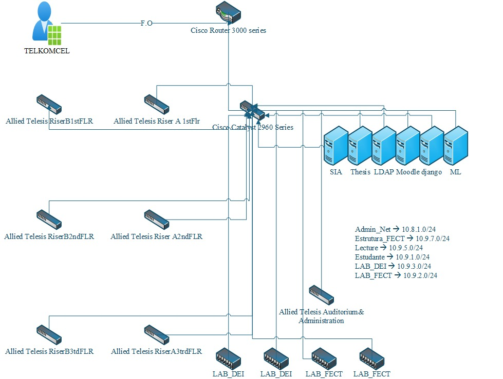

# Instalasaun SAGEDRAL-ML ba Rede Kampus FECT

> Guia deployment espesífiku bazeia ba diagrama [`FECT.jpg`](../FECT.jpg).
>
> Atualizasaun ikus: `2026-07-31`
>
> Deployment rekomendadu: **NIDS pasivu ho Local SPAN iha core switch**
>
> Estadu IPS durante pilot: **desativadu**



---

<a id="guia-komesa"></a>

## 0. Oinsá atu uza guia ida-ne'e

Guia ida-ne'e hakerek ba ema ne'ebé seidauk iha esperiénsia boot ho rede,
Cisco ka Linux. Lee tuir ordem. Labele salta diretamente ba komandu
konfigurasaun.

Ordem aprende no implementa:

1. Lee Seksaun 0 atu komprende liafuan tékniku.
2. Lee Seksaun 1–3 atu komprende topolojia no desizaun.
3. Priense inventáriu iha Seksaun 5 ho equipa rede kampus.
4. Instala sensor pasivu tuir Seksaun 6–13.
5. Hala'o pilot IDS tuir Seksaun 14.
6. Diskute IPS tuir Seksaun 20, liuliu Opsaun A.
7. Ativa block manual iha lab uluk.
8. Ativa automasaun deit depois teste, aprovasaun no rollback pasa.

Navegasaun lalais:

- [Glosáriu no konseitu báziku](#glossariu)
- [Topolojia no desizaun](#topolojia-desizaun)
- [Konfigurasaun SPAN](#konfigurasaun-span)
- [Instalasaun Linux no SAGEDRAL](#instalasaun-sensor)
- [Opsaun A: SPAN ho Cisco/firewall](#opsaun-a)
- [Teste IPS](#teste-ips)
- [Rollback IPS](#rollback-ips)

### 0.1 Regra atu lee ezemplu komandu

Guia uza tipu bloco oioin:

```text
Komandu Cisco ka diagrama uza label text.
```

```bash
# Komandu Linux uza label bash.
sudo systemctl status sagedral-ml
```

```toml
# Konfigurasaun SAGEDRAL uza label toml.
[ips]
enabled = false
```

Signifikadu símbolu:

| Símbolu | Signifikadu |
|---|---|
| `<VALOR>` | Placeholder; tenke troka ho valor real antes uza |
| `SUBSTITUI-*` | Placeholder iha file konfigurasaun; labele husik |
| `$NARAN` | Variável shell Linux ne'ebé rai valor temporáriu |
| `#` iha Linux/TOML | Komentáriu ka prompt superuser, depende konteksu |
| `>` iha Cisco prompt | User EXEC mode; asesu limitadu |
| `#` iha Cisco prompt | Privileged EXEC mode depois `enable` |
| `(config)#` | Global configuration mode |
| `(config-if)#` | Interface configuration mode |
| `Ctrl+Z` ka `end` | Sai husi configuration mode |

Komandu read-only hanesan `show` no `ip route` normalmenti la muda
konfigurasaun. Komandu hanesan `configure terminal`, `monitor session`,
`ip access-list`, `nft add` no `systemctl restart` bele muda sistema.

### 0.2 Diferensa entre IDS no IPS

**IDS** signifika *Intrusion Detection System*. Nia haree tráfiku, deteta
atividade suspeitu, kria alert no ajuda investigasaun. IDS la para pakote.

**IPS** signifika *Intrusion Prevention System*. Nia deteta no mos tenta para
atividade, por ezemplu blokeia IP iha firewall ka router.

Analojia simples:

```text
IDS = kamera seguransa ne'ebé haree no fó alarme.
IPS = kamera + guarda ne'ebé bele taka odamatan.
```

SAGEDRAL iha deployment SPAN mak “kamera”. Cisco router/firewall mak “guarda”
ne'ebé iha pozisaun atu para pakote.

### 0.3 Diferensa entre SPAN, source no destination

**SPAN** signifika *Switched Port Analyzer*. Switch halo kopia tráfiku husi
porta ida ba porta seluk atu sensor bele analiza.

- **Source SPAN:** porta ka VLAN ne'ebé nia tráfiku atu kopia.
- **Destination SPAN:** porta ne'ebé simu kopia no liga ba NIC capture.
- **RX:** tráfiku ne'ebé tama ba porta.
- **TX:** tráfiku ne'ebé sai husi porta.
- **Both:** RX no TX hotu.

SPAN la muda pakote orijinál. Se sensor mate, rede nafatin lao. Ida-ne'e mak
razaun atu hili SPAN ba faze dahuluk.

### 0.4 Glosáriu no konseitu báziku

<a id="glossariu"></a>

| Termu | Naran kompletu | Esplikasaun simples |
|---|---|---|
| AAA | Authentication, Authorization and Accounting | Kontrola sé bele login, saida nia bele halo no rejista asaun |
| ACL | Access Control List | Lista regra `permit` no `deny` iha router/switch |
| ACE | Access Control Entry | Regra ida iha ACL, por ezemplu “deny IP ida” |
| Admin_Net | Administration Network | Rede separadu ba jestaun dispozitivu |
| AF_PACKET | Linux packet capture interface | Maneira Linux simu pakote ho performa di'ak |
| API | Application Programming Interface | Dalan software ida ko'alia ho software/dispozitivu seluk |
| Baseline | Medisaun normál | Dadus kona-ba tráfiku normál antes ativa block |
| BPF | Berkeley Packet Filter | Filtro atu hili pakote ne'ebé sensor captura |
| Bypass | Dalan rezerva | Koneksaun ne'ebé permite tráfiku pasa se IPS inline falla |
| CA | Certificate Authority | Entidade ne'ebé asina TLS certificate atu prova identidade |
| Capture | Rekolla pakote | Prosesu lee pakote rede |
| CDN | Content Delivery Network | Rede server distribuidu; IP ida bele serve utilizadór barak |
| CDP | Cisco Discovery Protocol | Protokolu Cisco atu deskobre dispozitivu vizinhu |
| CEF | Common Event Format | Formatu padraun atu haruka eventu seguransa |
| CIDR | Classless Inter-Domain Routing | Notasaun subnet hanesan `10.9.1.0/24` |
| CLI | Command-Line Interface | Interface ne'ebé uza komandu teks |
| Core switch | Switch sentrál | Switch prinsipal ne'ebé liga segmentu barak |
| CPU | Central Processing Unit | Unidade prosesamentu iha server |
| DHCP | Dynamic Host Configuration Protocol | Servisu ne'ebé fó IP automátiku ba kliente |
| DNS | Domain Name System | Tradús naran hanesan `moodle.tl` ba IP |
| Dry-run | Simulasaun sem muda device | Controller kalkula asaun maibé la aplika ACL |
| Egress | Tráfiku sai | Pakote ne'ebé sai husi interface |
| Enforcement | Ezekusaun block | Device ne'ebé aplika regra atu para tráfiku |
| Fail-closed | Falla no taka | Se sistema falla, tráfiku para; seguru maibé bele halo outage |
| Fail-open | Falla no pasa | Se sistema falla, tráfiku kontinua; disponibilidade aas |
| Failover | Troka ba rezerva | Device segundu simu funsaun bainhira device prinsipal falla |
| False negative | Atake la deteta | Sistema konsidera normal maski atake iha |
| False positive | Alarme falsu | Sistema konsidera atake maski tráfiku normal |
| Firewall | Kontroladór tráfiku | Sistema ne'ebé permite ka rejeita pakote tuir regra |
| FQDN | Fully Qualified Domain Name | Naran DNS kompletu hanesan `controller.fect.local` |
| Gateway | Porta sai subnet | IP/device ne'ebé host uza atu asesu rede seluk |
| HA | High Availability | Dezenhu redundante atu servisu nafatin lao |
| HMAC | Hash-based Message Authentication Code | Asinatura atu prova mensajen mai husi fonte loos no la muda |
| Host | Dispozitivu ida | Komputadór, server, router ka device iha rede |
| Host key | Identidade SSH device | Xave ne'ebé ajuda konfirma router loos, la'ós imitasaun |
| HTTP/HTTPS | Web communication protocol | HTTPS proteje komunikasaun ho TLS |
| Idempotente | Seguru atu repete | Pedidu repetidu la kria block duplikadu |
| IDS | Intrusion Detection System | Sistema deteta no alerta, maibé la para tráfiku |
| IDPS | Intrusion Detection and Prevention System | Termu kombina IDS no IPS |
| Ingress | Tráfiku tama | Pakote ne'ebé tama ba interface |
| Inline | Iha dalan tráfiku | Pakote tenke liu device antes to'o destinasaun |
| Inter-VLAN | Entre VLAN rua | Tráfiku husi segmentu ida ba segmentu seluk |
| IP | Internet Protocol address | Enderesu device hanesan `10.9.1.10` |
| IPS | Intrusion Prevention System | Sistema deteta no tenta para tráfiku |
| IOS | Cisco Internetwork Operating System | Sistema operasaun iha Cisco modelu balu |
| IOS XE | Cisco IOS XE | Sistema Cisco modernu ho kapasidade programasaun boot liu |
| Kernel drop | Pakote lakon iha Linux | Sensor la konsege procesa pakote hotu |
| JSON | JavaScript Object Notation | Formatu teks estruturadu atu haruka dadus API/webhook |
| LAN | Local Area Network | Rede lokal kampus |
| Latency | Demora | Tempu ne'ebé pakote presiza atu viaja |
| Layer 2/L2 | Data-link layer | Switching bazeia ba MAC/VLAN |
| Layer 3/L3 | Network layer | Routing bazeia ba IP |
| LDAP | Lightweight Directory Access Protocol | Servisu diretóriu uza-na'in/identidade |
| Link | Koneksaun rede | Cabo ka koneksaun entre dispozitivu rua |
| Log | Rejistu eventu | Dadus kona-ba asaun no erru |
| MAC address | Media Access Control address | Identidade Layer 2 NIC hanesan `00:11:22:33:44:55` |
| MGMT | Management | Interface/rede ba administrasaun |
| Mirror | Kopia tráfiku | Liafuan seluk ba SPAN |
| MTU | Maximum Transmission Unit | Tamanhu pakote máximu iha link |
| mTLS | Mutual TLS | TLS ne'ebé server no client rua hotu prova identidade |
| NAT | Network Address Translation | Tradús IP internu ba IP seluk, normalmenti IP públiku |
| NAC | Network Access Control | Sistema atu autoriza ka karantina device iha rede |
| NETCONF | Network Configuration Protocol | Protokolu estruturadu atu jere device rede |
| NIC | Network Interface Card | Porta/karta rede iha server |
| NIDS | Network Intrusion Detection System | IDS ne'ebé monitoriza tráfiku rede |
| NOC | Network Operations Center | Ekipa/sala ne'ebé monitoriza rede |
| NTP | Network Time Protocol | Servisu sinkronizasaun oras |
| Out-of-band | Fora data path | Jestaun/monitorizasaun ne'ebé la lori tráfiku utilizadór |
| Packet loss | Pakote lakon | Persentajen pakote ne'ebé la to'o |
| PCAP | Packet Capture | File ne'ebé rai pakote kapturadu |
| Pilot | Implementasaun ki'ik | Teste kontroladu antes kobre rede hotu |
| Port | Porta físiku ka númeru servisu | Konteksu define porta switch ka TCP/UDP |
| Promiscuous mode | NIC simu frame hotu | Permite capture NIC lee tráfiku SPAN |
| RBAC | Role-Based Access Control | Permisaun tuir funsaun uza-na'in |
| Reconcile | Kompara no hadi'a state | Halo database no device iha block hanesan |
| RESTCONF | RESTCONF Protocol | API HTTPS estruturadu ba device rede |
| RADIUS | Remote Authentication Dial-In User Service | Servisu sentrál ba login no AAA device rede |
| Rollback | Fila ba konfigurasaun uluk | Hasai mudansa bainhira problema mosu |
| Router | Dispozitivu routing | Liga subnet/rede oioin no hili dalan pakote |
| RSPAN | Remote SPAN | SPAN ne'ebé lori kopia liu switch seluk |
| RX/TX | Receive/Transmit | Tráfiku simu/tráfiku haruka |
| SIEM | Security Information and Event Management | Sistema sentrál atu rekolla no analiza log seguransa |
| SNMP | Simple Network Management Protocol | Protokolu monitorizasaun dispozitivu |
| Source IP | IP origem | Enderesu husi device ne'ebé haruka pakote |
| SPAN | Switched Port Analyzer | Funsaun switch atu kopia tráfiku ba sensor |
| SSH | Secure Shell | Dalan enkriptadu atu asesu CLI remotamente |
| STP | Spanning Tree Protocol | Evita loop iha rede Layer 2 |
| Subnet | Grupu IP | Fahe rede iha parte hanesan `10.9.1.0/24` |
| SVI | Switched Virtual Interface | Interface Layer 3 ne'ebé sai gateway ba VLAN |
| SOP | Standard Operating Procedure | Dokumentu prosedimentu operasionál ne'ebé equipa aprova |
| TCAM | Ternary Content-Addressable Memory | Memória hardware switch/router ne'ebé rai regra forwarding/ACL |
| Throughput | Volume kada segundu | Kuantidade tráfiku ne'ebé sistema bele procesa |
| TLS | Transport Layer Security | Enkriptasaun no autentikasaun ba HTTPS |
| Trunk | Link lori VLAN barak | Porta ne'ebé transporta tag VLAN oioin |
| TTL block | Tempu moris block | Durasaun antes regra block hasai |
| Uplink | Link ba nivel aas | Koneksaun switch ba router/core |
| UTC | Coordinated Universal Time | Padraun oras globál atu halo timeline log konsistente |
| UUID | Universally Unique Identifier | Númeru/téks únika atu identifika alert/eventu |
| VLAN | Virtual Local Area Network | Segmentu lójiku ne'ebé separa tráfiku |
| VTY | Virtual Teletype | Linha Cisco ba asesu SSH/Telnet |
| VPN | Virtual Private Network | Tunnel enkriptadu ba asesu rede remotamente |
| WAN | Wide Area Network | Rede externa/internet/provider |
| Webhook | HTTP POST automátiku | SAGEDRAL haruka alert JSON ba controller |
| Whitelist | Lista protejidu | IP/CIDR ne'ebé sistema labele blokeia |

### 0.5 Konseitu subnet `/24`

Ezemplu `10.9.1.0/24` signifika rede ida ho máscara
`255.255.255.0`. Normalmente:

- `10.9.1.0` mak network address;
- `10.9.1.1` bele sai gateway, maibé tenke konfirma;
- `10.9.1.1–10.9.1.254` mak faixa host;
- `10.9.1.255` mak broadcast address.

Labele assume gateway sempre `.1`. Lee running config ka pergunta equipa rede.

### 0.6 Konseitu ACL ho analojia

ACL hanesan lista iha odamatan:

```text
Regra 10: labele husik IP A tama
Regra 20: husik equipa admin tama
Regra 30: husik ema seluk tama
```

Router lee regra husi leten ba kraik no para iha regra dahuluk ne'ebé match.
Ordem regra importante. Se `permit ip any any` iha leten, regra `deny` iha
kraik nunka uza. Se la iha regra match, ACL iha *implicit deny*, signifika
router rejeita pakote. Tanba ne'e, mudansa ACL bele taka rede se halo sala.

### 0.7 Limite responsabilidade guia

Guia fó template no prosesu, maibé la bele hatene valor ne'ebé diagrama la
hatudu: interface real, VLAN ID, gateway, ACL atual, IOS, NAT no routing.
Equipa rede kampus tenke priense valor sira-ne'e. Komandu ho placeholder la'ós
komandu prontu ba production.

---

<a id="topolojia-desizaun"></a>

## 1. Rezumu desizaun

Topolojia iha imajen hatudu:

```text
TELKOMCEL / fibra óptika
          │
          ▼
Cisco Router 3000 Series
          │ uplink
          ▼
Cisco Catalyst 2960 Series
    ├── server SIA
    ├── server Thesis
    ├── server LDAP
    ├── server Moodle
    ├── server Django
    ├── server ML
    ├── Allied Telesis riser andar 1–3
    ├── Auditóriu no Administrasaun
    ├── LAB DEI
    └── LAB FECT
```

Rede ida-ne'e uza switch core sentrál no segmentasaun subnet/VLAN. Tipu
deployment ne'ebé loos liu mak:

> **SAGEDRAL hanesan sensor NIDS pasivu, ho NIC capture ligadu ba porta
> destination SPAN iha Cisco Catalyst 2960 no NIC management separadu ligadu ba
> Admin_Net.**

### Tanba sá SPAN mak rekomendadu

- La muda data path kampus.
- La kria single point of failure foun.
- Bele observa tráfiku internet ba/husi subnet hotu liu husi uplink router.
- Rollback simples: hamos monitor session.
- Bele halo baseline no tuning sem risku SAGEDRAL blokeia estudante, docente,
  servidor ka router.

### Limitasaun importante

Iha mode SPAN, SAGEDRAL simu kopia tráfiku deit. Firewall SAGEDRAL atual aplika
regra iha chain Linux `INPUT` no `OUTPUT`; nia la blokeia tráfiku transit iha
Cisco router/switch.

Tanba ne'e:

```toml
[ips]
enabled = false
```

Komandu `sagedral-ml block` iha sensor SPAN la bele para tráfiku kampus. Atu
halo active prevention iha futuru, presiza:

1. integrasaun SAGEDRAL ho ACL/API Cisco; ka
2. firewall dedicadu ne'ebé bele simu block request; ka
3. deployment inline ne'ebé iha forward-chain, bypass no failover testadu.

Kapasidade sira-ne'e seidauk tenke ativa iha rede FECT ho implementasaun atual.

---

## 2. Mapa rede husi diagrama

| Segmentu | Subnet iha diagrama | VLAN ID | Gateway | Estatutu |
|---|---|---:|---|---|
| Admin_Net | `10.8.1.0/24` | Konfirma | Konfirma | Management sensor rekomendadu |
| Estrutura_FECT | `10.9.7.0/24` | Konfirma | Konfirma | Infraestrutura |
| Lecturer | `10.9.5.0/24` | Konfirma | Konfirma | Docente |
| Estudante | `10.9.1.0/24` | Konfirma | Konfirma | Estudante |
| LAB_DEI | `10.9.3.0/24` | Konfirma | Konfirma | Laboratóriu DEI |
| LAB_FECT | `10.9.2.0/24` | Konfirma | Konfirma | Laboratóriu FECT |

Diagrama la hatudu VLAN ID, gateway IP, interface name, trunk, link speed ka
dispozitivu ne'ebé halo inter-VLAN routing. Labele assume VLAN ID hanesan
oktet subnet.

---

## 3. Arkitetura deployment

```text
TELKOMCEL
    │
    ▼
Cisco Router 3000
    │
    │ source SPAN: porta uplink router ↔ core
    ▼
Cisco Catalyst 2960
    │
    ├───────────────► Porta SPAN destination
    │                         │
    │                         ▼
    │                 NIC 2: CAPTURE
    │                 sem IP, promiscuous
    │                 ┌──────────────────┐
    └── Admin_Net ───►│ NIC 1: MANAGEMENT│
                      │   SAGEDRAL-ML     │
                      └──────────────────┘
```

### 3.1 Cobertura tráfiku

| Tráfiku | Uplink router-core SPAN |
|---|---|
| Internet ↔ subnet kampus | Normalmente haree |
| Subnet A ↔ subnet B | Haree se routing liu husi router ne'ebé monitoriza |
| Host A ↔ Host B iha VLAN hanesan | Normalmente la haree |
| Server ↔ server iha VLAN hanesan | Normalmente la haree |
| Tráfiku ne'ebé switch L3 route lokalmente | La haree iha uplink router |

Se inter-VLAN routing hala'o iha core switch, presiza source VLAN, source port
tan ka sensor RSPAN. Konfirma routing ho komandu iha Seksaun 5.

### 3.2 Tanba sá presiza NIC rua

Cisco SPAN destination port normalmenti desativa ingress forwarding no la
partisipa iha STP, VTP, CDP ka DTP. Tanba ne'e, NIC capture la bele uza hanesan
management NIC.

Sensor tenke iha:

- **NIC management:** IP iha `Admin_Net 10.8.1.0/24`;
- **NIC capture:** sem IPv4/IPv6, ligadu ba SPAN destination.

---

## 4. Hardware rekomendadu ba pilot

| Komponente | Ponto hahú rekomendadu |
|---|---|
| CPU | 4 core x86-64 |
| RAM | 16 GB |
| Disku | SSD 256 GB ka liu |
| NIC management | 1 Gbps |
| NIC capture | Igual ka lalais liu source uplink |
| Sistema | Ubuntu Server 22.04 LTS |
| Aksesu | Console/VNC/IPMI durante instalasaun |

Ida-ne'e la'ós garantia capacity. Mede bandwidth peak uplink uluk. SPAN
destination bele drop pakote se tráfiku source boot liu kapasidade porta
destination. Uplink full-duplex 1 Gbps bele produz kopia RX+TX ne'ebé aproxima
2 Gbps.

Se drop aas:

- uza destination NIC/port lalais liu se hardware suporta;
- filtra VLAN ne'ebé kritiku;
- uza sensor tan;
- hamenus source;
- monitoriza `kernel_drop_rate_pct`.

---

## 5. Inventáriu antes muda switch

### 5.1 Dadus ne'ebé tenke priense

| Item | Valor real |
|---|---|
| Hostname core switch | `________________` |
| Modelu exatu no IOS | `________________` |
| Porta uplink ba Cisco Router | `________________` |
| Porta livre ba sensor capture | `________________` |
| Link speed uplink | `________________` |
| Link speed destination | `________________` |
| Interface management sensor | `________________` |
| Interface capture sensor | `________________` |
| IP management sensor | `________________` |
| Gateway Admin_Net | `________________` |
| DNS/NTP | `________________` |
| VLAN ID segmentu hotu | `________________` |
| Peak bandwidth | `________________` |

### 5.2 Komandu read-only iha Catalyst 2960

```text
enable
show version
show interfaces status
show interfaces trunk
show vlan brief
show etherchannel summary
show cdp neighbors detail
show monitor session all
show interfaces counters errors
show running-config
```

### 5.3 Komandu read-only iha router

```text
enable
show ip interface brief
show ip route
show running-config | section interface
show cdp neighbors detail
```

Konfirma:

- porta entre router no Catalyst;
- trunk VLAN;
- dispozitivu ne'ebé iha gateway subnet;
- VLAN management;
- porta livre ne'ebé la tama EtherChannel;
- monitor session ne'ebé iha ona.

Hili session number ne'ebé livre. Se `session 1` iha ona, labele hamos ka
substitui; uza númeru ne'ebé equipa rede aloka ba SAGEDRAL.

Halo backup running configuration antes mudansa:

```text
show running-config
copy running-config startup-config
```

Rai kopia config iha sistema backup organizasaun.

---

<a id="konfigurasaun-span"></a>

## 6. Konfigura Local SPAN iha Cisco Catalyst 2960

Dokumentasaun Cisco ba Catalyst 2960 permite source interface ka source VLAN,
direction `both|rx|tx`, no destination interface físiku. Source port no source
VLAN la bele mistura iha session ida.

Referénsia oficial:

- [Cisco Catalyst 2960 — Configuring SPAN and RSPAN](https://www.cisco.com/c/en/us/td/docs/switches/lan/catalyst2960/software/release/12-2_55_se/configuration/guide/scg_2960/swspan.html)
- [Cisco Catalyst 2960 Software Guide — SPAN PDF](https://www.cisco.com/c/en/us/td/docs/switches/lan/catalyst2960/software/release/15-0_2_se/configuration/guide/scg2960/swspan.pdf)

### 6.1 Template source uplink

Template assume equipa rede aloka `session 1`. Troka session/interface
placeholder ho valor real. Labele copy se seidauk konfirma.

```text
enable
configure terminal

monitor session 1 source interface <SOURCE-UPLINK-INTERFACE> both
monitor session 1 destination interface <SENSOR-DESTINATION-INTERFACE> encapsulation replicate

end
show monitor session 1
show running-config | include monitor.session
copy running-config startup-config
```

Iha template:

- `<SOURCE-UPLINK-INTERFACE>` mak porta uplink ba router, ezemplu
  `GigabitEthernet0/1`;
- `<SENSOR-DESTINATION-INTERFACE>` mak porta sensor capture, ezemplu
  `GigabitEthernet0/24`;
- `encapsulation replicate` tenta preserva encapsulation/VLAN tag.

Se IOS/modelu la suporta `encapsulation replicate`, uza:

```text
monitor session 1 destination interface <SENSOR-DESTINATION-INTERFACE>
```

### 6.2 Opsaun source VLAN

Uza VSPAN deit se uplink SPAN la fó coverage sufisiente no kapasidade
destination permite:

```text
enable
configure terminal

monitor session 1 source vlan <VLAN-ID-1> , <VLAN-ID-2> both
monitor session 1 destination interface <SENSOR-DESTINATION-INTERFACE>

end
show monitor session 1
copy running-config startup-config
```

`<VLAN-ID-1>` no `<VLAN-ID-2>` mak placeholder; troka antes hala'o. Labele
mistura `source interface` ho `source vlan` iha session hanesan.

### 6.3 Regra porta destination

- Tenke porta físiku iha switch hanesan.
- Labele EtherChannel.
- Labele source port.
- Labele uza ba endpoint normal.
- Nia konfigurasaun normal suspende durante SPAN.
- Monitoriza oversubscription/drop.
- Labele ativa ingress iha destination port ba deployment pasivu.

---

<a id="instalasaun-sensor"></a>

## 7. Prepara Linux sensor

### 7.1 Identifika NIC

```bash
ip -brief link
ip -brief address
sudo lshw -class network -short
sudo ethtool enp1s0
sudo ethtool enp2s0
```

Iha ezemplu:

- `enp1s0` = management;
- `enp2s0` = capture.

Troka tuir hardware real.

### 7.2 Konfigura management no capture NIC

Ezemplu Netplan:

```yaml
network:
  version: 2
  renderer: networkd
  ethernets:
    enp1s0:
      addresses:
        - "IP-SENSOR-MANAGEMENT/24"
      routes:
        - to: default
          via: "GATEWAY-ADMIN-NET"
      nameservers:
        addresses:
          - "DNS-KAMPUS"
    enp2s0:
      dhcp4: false
      dhcp6: false
      link-local: []
      optional: true
```

Troka string placeholder ho IP real. Uza `netplan try` atu rollback
automátiku se management lakon:

```bash
sudo netplan generate
sudo netplan try
```

Depois confirma:

```bash
ip -brief address
ip route

GATEWAY_ADMIN_REAL="SUBSTITUI-IP-GATEWAY"
ping -c 3 "$GATEWAY_ADMIN_REAL"
```

Troka `SUBSTITUI-IP-GATEWAY` ho IP real antes hala'o.

Ativa capture NIC:

```bash
SAGEDRAL_CAPTURE_IFACE="enp2s0"
sudo ip link set "$SAGEDRAL_CAPTURE_IFACE" up
sudo ip link set "$SAGEDRAL_CAPTURE_IFACE" promisc on
ip -details link show "$SAGEDRAL_CAPTURE_IFACE"
```

Capture NIC la tenke iha IP:

```bash
ip address show dev "$SAGEDRAL_CAPTURE_IFACE"
```

### 7.3 Sinkroniza tempu

```bash
sudo apt-get update
sudo apt-get install -y chrony
sudo systemctl enable --now chrony
chronyc tracking
```

Timestamp loos importante ba korrelasaun alerta, Cisco log no server log.

---

## 8. Instala SAGEDRAL-ML

```bash
sudo apt-get update
sudo apt-get install -y git

git clone https://github.com/herciomoreira3/SAGEDRAL-ML-Smart-Adaptive-Guardian-for-Detection-Response-and-Adaptive-Learning-ML.git
cd SAGEDRAL-ML-Smart-Adaptive-Guardian-for-Detection-Response-and-Adaptive-Learning-ML

sudo bash scripts/install.sh
```

Verifika:

```bash
command -v sagedral-ml
sagedral-ml --version
sudo systemctl status sagedral-ml --no-pager -l
sagedral-ml health
```

---

## 9. Konfigura SAGEDRAL ba pilot FECT

Edita:

```bash
sudo nano /etc/sagedral/config.toml
```

Konfigurasaun rekomendadu:

```toml
[capture]
interface = "enp2s0"
backend = "af_packet"
bpf_filter = ""
promiscuous = true
queue_maxsize = 10000
watchdog_idle_seconds = 30

[feature_extraction]
flow_timeout = 60
max_packets_per_flow = 1000
max_active_flows = 50000

[ml]
enabled = true
model_dir = "/var/lib/sagedral-ml/models"
anomaly_threshold = 0.7
classifier_threshold = 0.6
batch_size = 32
drift_enabled = true

[decision]
alert_threshold = 0.5
block_threshold = 0.7
weight_signature = 0.4
weight_ml = 0.6
dedup_window = 300

[ips]
enabled = false
preferred_backend = "nftables"
whitelist = ["127.0.0.1", "::1"]

[api]
host = "127.0.0.1"
port = 8000
metrics_enabled = true

[database]
backend = "sqlite"
path = "/var/lib/sagedral-ml/sagedral.db"
retention_days_alerts = 30
retention_days_traffic = 7

[performance]
detection_workers = 1
profile_enabled = false
```

### 9.1 Backend capture

Hahu ho `af_packet` tanba sensor observa uplink sentrál. Se backend falla iha
hardware/kernel:

```toml
[capture]
backend = "libpcap"
```

Depois restart no kompara drop/CPU. `scapy` bele uza ba lab ka traffic ki'ik.

### 9.2 Whitelist infraestrutura

Depois login, aumenta deit IP kritiku:

```bash
IP_ROUTER_MGMT="SUBSTITUI-IP-ROUTER"
IP_CORE_SWITCH="SUBSTITUI-IP-CORE-SWITCH"
IP_SENSOR_MGMT="SUBSTITUI-IP-SENSOR"
IP_MONITORING="SUBSTITUI-IP-MONITORING"

sagedral-ml whitelist add "$IP_ROUTER_MGMT" --note "Router FECT"
sagedral-ml whitelist add "$IP_CORE_SWITCH" --note "Core Catalyst 2960"
sagedral-ml whitelist add "$IP_SENSOR_MGMT" --note "SAGEDRAL management"
sagedral-ml whitelist add "$IP_MONITORING" --note "Monitoring/NOC"
```

Troka placeholder ho IP real. Labele whitelist `10.9.0.0/16` ka subnet
Estudante/Lab hotu; ida-ne'e bele taka detesaun/blokeiu internal iha futuru.

### 9.3 Valida no restart

```bash
sudo -u sagedral env \
  HOME=/var/lib/sagedral-ml \
  SAGEDRAL_CONFIG_PATH=/etc/sagedral/config.toml \
  sagedral-ml config validate

sudo systemctl restart sagedral-ml
sudo systemctl status sagedral-ml --no-pager -l
sudo journalctl -u sagedral-ml -n 100 --no-pager -o cat
```

---

## 10. Login no dashboard

### 10.1 Login dahuluk

```bash
sudo cat /var/lib/sagedral-ml/.sagedral-admin-secret
sagedral-ml login --username admin
```

File `.sagedral-admin-secret` iha password bootstrap. Lee husi console
seguru, login, depois troka password. Labele haruka secret liu email/chat ka
rai iha Git.

Durante install lokál:

```text
http://127.0.0.1:8000
```

`127.0.0.1` signifika deit komputadór sensor rasik bele asesu. Ida-ne'e seguru
ba setup, maibé operator iha Admin_Net presiza reverse proxy.

### 10.2 Saida mak Nginx no TLS

**Nginx** mak web server/reverse proxy. Nia simu HTTPS iha porta `443`, verifica
certificate no haruka pedidu ba SAGEDRAL lokal iha `127.0.0.1:8000`.

**TLS certificate** prova identidade website no enkripta password/token. Uza
certificate husi CA kampus ka CA ne'ebé browser/host kampus trust. Certificate
self-signed bele uza ba lab, la rekomenda ba production.

```text
Browser Admin_Net
      │ HTTPS :443
      ▼
    Nginx
      │ HTTP lokal :8000
      ▼
  SAGEDRAL API
```

### 10.3 Prepara naran DNS no certificate

Priense:

| Item | Valor |
|---|---|
| FQDN dashboard | `________________` |
| IP management sensor | `________________` |
| Certificate file | `________________` |
| Private key file | `________________` |
| CA issuer | `________________` |
| Expiry | `________________` |

Ezemplu FQDN: `sagedral.fect.local`. DNS tenke resolve naran ne'e ba IP
management sensor. Certificate nia SAN (*Subject Alternative Name*) tenke
inklui FQDN ne'ebá.

### 10.4 Instala no configura Nginx

Husi root repositóriu:

```bash
sudo apt-get update
sudo apt-get install -y nginx

sudo cp deploy/nginx-sagedral.conf \
  /etc/nginx/sites-available/sagedral-ml
sudo nano /etc/nginx/sites-available/sagedral-ml
```

Iha template, troka:

- `sagedral.example.internal` ho FQDN real;
- `/etc/ssl/certs/sagedral.crt` ho certificate real;
- `/etc/ssl/private/sagedral.key` ho private key real.

Atu limita dashboard ba Admin_Net, aumenta iha `location /` antes
`proxy_pass`:

```nginx
allow 10.8.1.0/24;
deny all;
```

Konfigurasaun prinsipál:

```nginx
server {
    listen 443 ssl http2;
    server_name sagedral.fect.local;

    ssl_certificate /etc/ssl/certs/sagedral.crt;
    ssl_certificate_key /etc/ssl/private/sagedral.key;
    ssl_protocols TLSv1.2 TLSv1.3;

    location / {
        allow 10.8.1.0/24;
        deny all;

        proxy_pass http://127.0.0.1:8000;
        proxy_http_version 1.1;
        proxy_set_header Host $host;
        proxy_set_header X-Real-IP $remote_addr;
        proxy_set_header X-Forwarded-For $proxy_add_x_forwarded_for;
        proxy_set_header X-Forwarded-Proto https;
        proxy_set_header Upgrade $http_upgrade;
        proxy_set_header Connection "upgrade";
    }
}
```

Labele substitui template tomak se nia iha security header no rate limit
adisionál. Ezemplu iha leten hatudu parte prinsipál deit.

Ativa site. Hasai symlink `default` deit se server ida-ne'e la uza site Nginx
seluk:

```bash
sudo ln -s /etc/nginx/sites-available/sagedral-ml \
  /etc/nginx/sites-enabled/sagedral-ml
sudo rm -f /etc/nginx/sites-enabled/default
sudo nginx -t
sudo systemctl enable --now nginx
sudo systemctl reload nginx
```

`nginx -t` tenke hatudu syntax successful antes reload.

### 10.5 Firewall management

Se uza UFW:

```bash
sudo ufw allow from 10.8.1.0/24 to any port 443 proto tcp
sudo ufw deny 8000/tcp
sudo ufw status verbose
```

Antes ativa UFW remotamente, konfirma SSH management rule no console recovery.
Labele taka SSH ne'ebé operator uza.

API SAGEDRAL nafatin bind ba localhost:

```toml
[api]
host = "127.0.0.1"
port = 8000
trusted_proxies = ["127.0.0.1", "::1"]
```

Valida no restart:

```bash
sagedral-ml config validate
sudo systemctl restart sagedral-ml
sudo nginx -t
sudo systemctl reload nginx
```

### 10.6 Test dashboard

Iha sensor:

```bash
curl -f http://127.0.0.1:8000/healthz
curl -I https://SUBSTITUI-FQDN
```

Iha host Admin_Net:

```bash
getent hosts SUBSTITUI-FQDN
curl -I https://SUBSTITUI-FQDN
```

Test husi rede Estudante/Lab tenke rejeitadu tuir policy. Verifika certificate
iha browser: naran, issuer no expiry tenke loos.

### 10.7 Konta no role

Kria konta personal; labele uza konta `admin` ida ba ema hotu:

| Role | Uzu |
|---|---|
| Admin | Jere config, uza-na'in, whitelist no integrasaun |
| Analyst | Investiga alert no response ne'ebé permite |
| Viewer | Haree dashboard sem muda seguransa |

Depois:

- troka password bootstrap;
- desativa/limita konta default tuir feature disponivel;
- ativa password forte;
- review session/token;
- audit login falla;
- backup certificate no config ho permission seguru.

Labele expoin porta `8000` ba Estudante, Lecturer ka internet.

---

## 11. Modelu Machine Learning

### 11.1 Komprende fallback no modelu trained

**Fallback modelu** mak modelu sintétiku ne'ebé installer kria atu sistema
bele start no pipeline bele testadu. Metrika fallback la reprezenta akurásia
iha rede kampus.

**Modelu trained** mak rezultadu aprende husi dataset real hanesan
CICIDS2017/2018. Depois training, `model info` no dashboard `/model` bele
hatudu:

- **Anomaly accuracy:** parte predisaun anomaly/normal ne'ebé loos;
- **Anomaly F1:** balansu entre deteta atake no evita alarme falsu;
- **Classification accuracy:** parte attack class ne'ebé modelu klasifika
  loos;
- **Holdout:** parte dataset ne'ebé la uza ba aprende, uza ba teste.

Akurásia aas la garante modelu di'ak iha FECT. Dataset publiku no tráfiku
kampus bele diferente. Baseline, feedback no avaliasaun lokal nafatin presiza.

### 11.2 Rekizitu training

Training dataset boot bele demora oras no uza RAM/disku boot. Antes hahú:

```bash
df -h
free -h
nproc
sagedral-ml model info
sagedral-ml backup create
```

Rekomendasaun:

- SSD ho espasu livre natoon;
- RAM 16 GB mínimu ba sample limitadu;
- RAM boot liu ba full corpus;
- terminal `tmux` ka console ne'ebé la fasil deskonektadu;
- la hala'o iha tempu peak se server ida mos captura tráfiku production;
- backup modelu no database.

### 11.3 Prepara diretóriu dataset

```bash
sudo install -d -o sagedral -g sagedral -m 0750 \
  /var/lib/sagedral-ml/datasets/cicids2017 \
  /var/lib/sagedral-ml/datasets/cicids2018
```

`0750` signifika owner bele lee/hakerek/tama, group bele lee/tama, ema seluk
la iha asesu.

### 11.4 Download CICIDS2017

1. Loke [UNB CICIDS2017](https://www.unb.ca/cic/datasets/ids-2017.html).
2. Lee terms/license.
3. Download `MachineLearningCSV.zip`.
4. Transfere file ba sensor/training server.

Depois:

```bash
sudo apt-get update
sudo apt-get install -y unzip

sudo unzip MachineLearningCSV.zip \
  -d /var/lib/sagedral-ml/datasets/cicids2017

sudo chown -R sagedral:sagedral \
  /var/lib/sagedral-ml/datasets/cicids2017
sudo find /var/lib/sagedral-ml/datasets/cicids2017 \
  -type d -exec chmod 0750 {} \;
sudo find /var/lib/sagedral-ml/datasets/cicids2017 \
  -type f -name '*.csv' -exec chmod 0640 {} \;
```

Konfirma:

```bash
find /var/lib/sagedral-ml/datasets/cicids2017 \
  -type f -iname '*.csv' | head
```

### 11.5 Download CSE-CIC-IDS2018

UNB publika CSV processadu iha AWS public bucket. Lee informasaun iha
[UNB CSE-CIC-IDS2018](https://www.unb.ca/cic/datasets/ids-2018.html).

```bash
sudo apt-get install -y awscli

sudo -u sagedral aws s3 sync \
  --no-sign-request \
  --region us-east-1 \
  "s3://cse-cic-ids2018/Processed Traffic Data for ML Algorithms/" \
  /var/lib/sagedral-ml/datasets/cicids2018
```

Depois:

```bash
sudo chown -R sagedral:sagedral \
  /var/lib/sagedral-ml/datasets/cicids2018
sudo find /var/lib/sagedral-ml/datasets/cicids2018 \
  -type d -exec chmod 0750 {} \;
sudo find /var/lib/sagedral-ml/datasets/cicids2018 \
  -type f -name '*.csv' -exec chmod 0640 {} \;
```

Labele aponta training ba bucket full ne'ebé inklui log/file seluk. Uza pasta
`Processed Traffic Data for ML Algorithms`.

### 11.6 Training CICIDS2017 ho sample limitadu

Komandu rekomendadu ba tentativa dahuluk:

```bash
sudo -u sagedral env \
  HOME=/var/lib/sagedral-ml \
  SAGEDRAL_CONFIG_PATH=/etc/sagedral/config.toml \
  sagedral-ml train \
  --dataset /var/lib/sagedral-ml/datasets/cicids2017 \
  --save-dir /var/lib/sagedral-ml/models \
  --train-test-split 0.2 \
  --max-rows-per-class 100000
```

Signifikadu:

| Opsaun | Signifikadu |
|---|---|
| `--dataset` | Pasta CSV input |
| `--save-dir` | Pasta publica modelu |
| `--train-test-split 0.2` | Rai 20% ba holdout test |
| `--max-rows-per-class 100000` | Limita kada class ba row 100.000 |

Limite per-class ajuda RAM no evita class boot domina dataset. Pipeline uza
sample determinístiku atu run repetidu konsistente.

### 11.7 Training full corpus

Uza deit se hardware natoon:

```bash
sudo -u sagedral env \
  HOME=/var/lib/sagedral-ml \
  SAGEDRAL_CONFIG_PATH=/etc/sagedral/config.toml \
  sagedral-ml train \
  --dataset /var/lib/sagedral-ml/datasets/cicids2017 \
  --save-dir /var/lib/sagedral-ml/models \
  --train-test-split 0.2 \
  --max-rows-per-class 0
```

`0` signifika la limita row. Monitoriza:

```bash
free -h
df -h /var/lib/sagedral-ml
ps -eo pid,pcpu,pmem,cmd | grep sagedral-ml
```

Se Linux OOM killer para prosesu, uza sample limitadu ka server training ho
RAM boot liu. `OOM` signifika *Out Of Memory*.

### 11.8 Kombina CICIDS2017 no 2018

Konfirma parent `/var/lib/sagedral-ml/datasets` iha deit CSV dataset ne'ebé
hakarak:

```bash
find /var/lib/sagedral-ml/datasets \
  -type f -iname '*.csv' | head -n 30
```

Depois:

```bash
sudo -u sagedral env \
  HOME=/var/lib/sagedral-ml \
  SAGEDRAL_CONFIG_PATH=/etc/sagedral/config.toml \
  sagedral-ml train \
  --dataset /var/lib/sagedral-ml/datasets \
  --save-dir /var/lib/sagedral-ml/models \
  --train-test-split 0.2 \
  --max-rows-per-class 100000
```

Ba full corpus kombina, muda `--max-rows-per-class` ba `0` deit depois sample
run pasa no capacity aprova.

### 11.9 Ativa no verifika modelu

Training publica versaun modelu foun atomikamente. Service ne'ebé dadaun lao
presiza restart atu load:

```bash
sudo systemctl restart sagedral-ml

sudo -u sagedral env \
  HOME=/var/lib/sagedral-ml \
  SAGEDRAL_CONFIG_PATH=/etc/sagedral/config.toml \
  sagedral-ml model info

sudo cat /var/lib/sagedral-ml/models/active_model.json
```

Rezultadu espera:

- `loaded: true`;
- `model_version` la iha `fallback`;
- anomaly accuracy la `null`;
- anomaly F1 la `null`;
- classifier accuracy la `null`;
- dashboard `/model` hatudu percentajen.

Se dashboard nafatin zero/null:

```bash
sudo journalctl -u sagedral-ml -n 200 --no-pager
sudo ls -la /var/lib/sagedral-ml/models
sudo cat /var/lib/sagedral-ml/models/model_metadata.json
sudo cat /var/lib/sagedral-ml/models/active_model.json
```

Konfirma service user `sagedral` bele lee modelu no service load versaun ativu.

### 11.10 Avaliasaun no tuning

Antes aumenta sensitividade ka auto-block:

- halo baseline kampus 7–14 loron;
- marka false/true positive;
- monitoriza PSI;
- avalia dataset separadu;
- labele uza akurásia synthetic hanesan prova production.

**PSI** signifika *Population Stability Index*. Nia ajuda haree distribuisaun
tráfiku foun muda dook husi dadus ne'ebé modelu aprende. Drift aas signifika
modelu presiza review/retraining, la'ós automatikamente atake.

Holdout random la substitui teste temporal. Di'ak liu rezerva loron/file
separadu ne'ebé la tama training. Dokumenta:

- dataset no file ne'ebé uza;
- data training;
- row per class;
- train/test split;
- accuracy, precision, recall no F1;
- confusion matrix;
- model version;
- operator;
- hardware no durasaun.

Labele ativa IPS automátiku deit tanba accuracy aas. False positive ba gateway,
DNS, DHCP ka LDAP bele interrompe kampus.

---

## 12. Verifika SPAN no capture

### 12.1 Iha Cisco

```text
show monitor session 1
show interfaces counters errors
show interfaces GigabitEthernet0/1
show interfaces GigabitEthernet0/24
```

Konfirma source, direction `both`, destination no status `up`.

### 12.2 Iha Linux

```bash
SAGEDRAL_CAPTURE_IFACE="enp2s0"

sudo ethtool "$SAGEDRAL_CAPTURE_IFACE"
sudo tcpdump -eni "$SAGEDRAL_CAPTURE_IFACE" -c 100
sudo tcpdump -eni "$SAGEDRAL_CAPTURE_IFACE" -c 100 vlan
```

Se `encapsulation replicate` la suporta, packet bele mai sem VLAN tag; komandu
primeiru nafatin tenke haree tráfiku.

Self-test:

```bash
sudo sagedral-ml selftest capture \
  --iface "$SAGEDRAL_CAPTURE_IFACE" \
  --duration 15

sagedral-ml selftest sniffer-status
sagedral-ml health
curl -s http://127.0.0.1:8000/metrics
```

### 12.3 Test coverage sem atake

Husi segmentu ida-idak:

1. ping gateway;
2. halo DNS query;
3. loke website HTTPS ne'ebé autorizadu;
4. asesu server internal ne'ebé normal;
5. konfirma source/destination/subnet mosu iha tcpdump/dashboard.

| Segmentu | Internet | Server internal | Haree iha sensor |
|---|---|---|---|
| Admin_Net | [ ] | [ ] | [ ] |
| Estrutura_FECT | [ ] | [ ] | [ ] |
| Lecturer | [ ] | [ ] | [ ] |
| Estudante | [ ] | [ ] | [ ] |
| LAB_DEI | [ ] | [ ] | [ ] |
| LAB_FECT | [ ] | [ ] | [ ] |

Se tráfiku internet haree maibé inter-VLAN la haree, routing karik la liu
source port ne'ebé monitoriza.

---

## 13. Monitorizasaun pilot

```bash
sagedral-ml health
sagedral-ml status
sagedral-ml alerts list --limit 50
sagedral-ml model info

sudo journalctl -u sagedral-ml -f
curl -s http://127.0.0.1:8000/metrics
df -h /var/lib/sagedral-ml
```

Haree:

- `capture_running`;
- packet count;
- queue drop;
- kernel drop;
- CPU no RAM;
- active flow;
- model fallback/version;
- false positive per subnet;
- disk/database growth.

### 13.1 Alvu pilot

- packet drop iha limite ne'ebé equipa aprova;
- la iha service restart repetitivu;
- dashboard bele asesu deit husi management;
- alerta iha timestamp no subnet loos;
- source uplink fó coverage ne'ebé dokumentadu;
- IPS nafatin desativadu.

---

## 14. Faze deployment

### Faze 0 — Inventáriu

- Konfirma port/VLAN/routing/link speed.
- Backup Cisco config.
- Define IP sensor no NTP.
- Aprova mudansa ho equipa rede.

### Faze 1 — Sensor pasivu

- Instala Linux ho NIC rua.
- Instala SAGEDRAL.
- Konfigura `ips.enabled = false`.
- Konfigura SPAN uplink.
- Test capture sem traffic atake.

### Faze 2 — Baseline

- Kolekta estatístika 7–14 loron.
- Tuning threshold no rule.
- Train modelu CICIDS.
- Marka false/true positive.
- Mede drop no capacity.

### Faze 3 — Kobre gap visibilidade

- Identifika same-VLAN traffic ne'ebé uplink la haree.
- Hili source VLAN, RSPAN ka sensor tan.
- Labele hatama source barak liu capacity destination.

### Faze 4 — Active response

Se FECT presiza auto-block:

- dezenha integrasaun Cisco ACL/firewall;
- implementa permission, audit, timeout no rollback;
- teste iha lab;
- halo peer review;
- ativa deit depois change approval.

Labele transforma sensor SPAN diretamente ba inline iha production sem
arkitetura no teste foun.

---

## 15. Rollback

### 15.1 Rollback SPAN

Iha Catalyst:

```text
enable
configure terminal
no monitor session 1
end
show monitor session all
copy running-config startup-config
```

Ida-ne'e para kopia tráfiku ba sensor no la tenke interrompe data path.

### 15.2 Para SAGEDRAL

```bash
sudo systemctl stop sagedral-ml
sudo systemctl disable sagedral-ml
```

### 15.3 Reverte Linux management

Uza `netplan try` no backup file atu restaura konfigurasaun. Labele hamos
management route durante remote session sem console.

---

## 16. Troubleshooting

### 16.1 Capture NIC `UP`, maibé pakote zero

```bash
ip -details link show enp2s0
sudo tcpdump -ni enp2s0 -c 20
```

Konfirma:

- SPAN session active;
- source interface loos;
- destination interface loos;
- cabo/link;
- source port iha traffic;
- capture NIC la tama management bond/bridge;
- Cisco destination port la `shutdown`.

### 16.2 Haree deit VLAN ida

- Konfirma source port mak trunk.
- Haree `show interfaces trunk`.
- Konfirma allowed/active VLAN.
- Se uza filter VLAN, haree session config.
- Se IOS hamos tags, traffic nafatin bele haree maibé sem VLAN metadata.

### 16.3 Drop aas

- Kompara link speed source/destination.
- Haree `ethtool -S enp2s0`.
- Haree SAGEDRAL metrics.
- Filtra VLAN ka source.
- Troka backend ba `af_packet`.
- Aumenta hardware ka fahe ba sensor tan.

### 16.4 Dashboard la bele asesu

```bash
curl -f http://127.0.0.1:8000/healthz
sudo ss -ltnp | grep 8000
sudo journalctl -u sagedral-ml -n 100
sudo nginx -t
```

Konfirma Nginx, certificate, firewall management no DNS.

---

## 17. Seguransa no privasidade

- NIC capture sem IP.
- Dashboard deit iha Admin_Net liu husi TLS.
- Uza RBAC no konta personal.
- Rotasaun secret no password.
- Limita retention tuir polítika kampus.
- Flow metadata bele konsidera dadus sensível; asesu no backup tenke kontrola.
- SAGEDRAL la tenke grava full PCAP automaticamente, maibé operator nia
  `tcpdump` bele grava payload; uza deit ho autorizasaun.
- Audit mudansa Cisco, SAGEDRAL no firewall.
- Hala'o teste atake deit iha lab izoladu no ho aprovasaun.

---

## 18. Checklist acceptance

- [ ] Porta uplink router-core identifika ho prova.
- [ ] VLAN ID no gateway hotu dokumentadu.
- [ ] Running config Cisco backup ona.
- [ ] NIC management no capture separadu.
- [ ] Capture NIC sem IP.
- [ ] SPAN session hatudu source/destination loos.
- [ ] Traffic subnet hotu testadu sem atake.
- [ ] Same-VLAN visibility gap dokumentadu.
- [ ] `ips.enabled = false`.
- [ ] Config validate pasa.
- [ ] Service health no capture stats saudavel.
- [ ] Dashboard TLS deit husi Admin_Net.
- [ ] Admin bootstrap troka.
- [ ] Modelu trained ka fallback hatudu nota klaru.
- [ ] Queue/kernel drop iha limite.
- [ ] Rollback SPAN testadu.
- [ ] Equipa rede no seguransa aprova pilot.

---

## 19. Konkluzaun

Ba topolojia FECT iha `FECT.jpg`, deployment ne'ebé di'ak liu agora mak:

```text
Local SPAN iha Cisco Catalyst 2960
        +
Sensor SAGEDRAL ho NIC rua
        +
Management iha Admin_Net
        +
Capture NIC sem IP
        +
IPS desativadu durante pilot
```

Ida-ne'e fó visibilidade sentrál ho risku ki'ik. Active blocking ba tráfiku
kampus presiza integrasaun Cisco/firewall ka arkitetura inline ne'ebé seidauk
tama iha deployment ida-ne'e.

---

## 20. Planu kompletu atu ativa IPS

Seksaun ida-ne'e prepara matéria téknika ba diskusaun ho equipa TI, rede,
seguransa no jestaun kampus. La bele ativa IPS iha rede produsaun antes
responsabilidade, janela manutensaun, teste no rollback hetan aprovasaun.

### 20.1 Estado implementasaun agora

Iha versaun atual:

- `[ips].enabled = true` permite SAGEDRAL halo block liu husi `nftables` ka
  `iptables`;
- backend ne'ebé simu mak `nftables` no `iptables`; valor `cisco` seidauk
  eziste;
- SAGEDRAL aumenta IP ba blocklist no rai eventu iha database;
- whitelist, block manual, unblock no auto-unblock disponivel;
- rule firewall automátiku proteje tráfiku ne'ebé tama ka sai husi host
  SAGEDRAL liu husi chain `INPUT` no `OUTPUT`;
- rule automátiku seidauk kria chain `FORWARD`;
- integrasaun atu muda Cisco ACL/firewall externu seidauk implementadu.

Nune'e, `ips.enabled = true` iha sensor SPAN sei **la blokeia** tráfiku kampus.
SPAN entrega kopia pakote deit; pakote orijinál kontinua liu router no switch.

```text
SPAN:

Pakote orijinál ───────────────> destinasaun
          └── kopia ──> SAGEDRAL

SAGEDRAL bele analiza kopia, maibé la iha data path.
```

IPS transit bele funsiona deit se uza ida husi modelu tuirmai:

| Modelu | Pozisaun SAGEDRAL | Mekanizmu block | Estado |
|---|---|---|---|
| SPAN + Cisco/firewall | Fora data path | ACL/API/SSH iha enforcement device | Rekomendadu; presiza integrasaun foun |
| Gateway routed inline | Iha data path | `nftables` chain `FORWARD` | Bele halo pilot depois hardening |
| Transparent bridge inline | Iha data path Layer 2 | Bridge firewall | Presiza dezenvolvimentu no bypass/HA |
| Host IPS | Iha server ida-idak | `INPUT/OUTPUT` | Disponivel agora, maibé deit proteje host |

<a id="opsaun-a"></a>

### 20.2 Opsaun A — SPAN ho enforcement iha Cisco/firewall

Ida-ne'e mak opsaun di'ak liu ba topolojia FECT tanba sensor nafatin pasivu no
la sai single point of failure ba internet kampus.

```text
                         kopia SPAN
Internet ─ Router ─ Core ─────────────> SAGEDRAL
             ▲                             │
             └──── pedidu block ACL ──────┘
```

SAGEDRAL deteta IP suspeitu, depois adapter enforcement haruka asaun ba router
ka firewall. Router/firewall mak para pakote orijinál.

#### Dadus ne'ebé presiza husi kampus

- modelu exatu router/firewall no versaun IOS/firmware;
- interface ne'ebé liga TELKOMCEL no interface ne'ebé liga core;
- running ACL, NAT, policy routing no dynamic routing;
- VLAN/SVI gateway iha router ka iha switch Layer 3 seluk;
- maneira jestaun disponivel: SSH, NETCONF, RESTCONF ka API vendor;
- konta service ho priviléjiu mínimu;
- backup running config no prosedimentu restore;
- IP management router/firewall;
- HA/failover iha enforcement device;
- ekipa ne'ebé iha autoridade atu aprova no reverte block.

Catalyst 2960 normalmenti serve hanesan access/Layer 2 switch. Enforcement
tenke halo iha router/firewall ka Layer 3 gateway ne'ebé tráfiku hotu liu.
Konfirma modelu no lisensa antes hili API ka sintaxe ACL.

#### Kontratu adapter Cisco ne'ebé presiza dezenvolve

Adapter foun tenke implementa operasaun sira-ne'e:

```text
block(ip, duration, reason, event_id)
unblock(ip, event_id)
list_active_blocks()
health_check()
reconcile(database_state, device_state)
```

Rekizitu obrigatóriu:

- idempotente: pedidu repetidu la kria ACE duplikadu;
- timeout: block temporáriu tenke hasai automatikamente;
- whitelist: rejeita gateway, DNS, DHCP, NTP, LDAP, management no sensor;
- audit: rai operator, tempu, IP, razaun, device no rezultadu;
- retry limitadu ho backoff;
- rate limit atu evita ACL boot liu;
- maximum active block;
- dry-run mode;
- TLS/SSH host-key verification;
- credential iha secret store, la iha `config.toml`;
- reconcile depois restart;
- circuit breaker se device la responde;
- rollback ba ACE espesífiku deit.

`preferred_backend = "cisco"` sei la pasa validasaun iha versaun atual. Tenke
implementa backend, teste no release versaun foun antes uza valor ida-ne'e.

#### Ezemplu ACL manual ba laboratóriu

Ezemplu ida-ne'e serve ba diskusaun no lab izoladu deit. La bele aplika iha
production antes lee ACL ne'ebé iha ona. IOS permite ACL ida deit kada
interface, kada protokolu no kada diresaun; se ACL iha ona, tenke integra ACE
foun iha ACL ne'ebá, la'ós substitui.

```text
enable
show running-config | section access-list
show ip interface
show access-lists
```

Template lab:

```text
configure terminal
ip access-list extended SAGEDRAL-LAB-IN
  10 remark SAGEDRAL temporary test block
  20 deny ip host 198.51.100.77 any log
  1000 permit ip any any
exit
interface <INTERFACE-LAB-IN>
  ip access-group SAGEDRAL-LAB-IN in
end
show access-lists SAGEDRAL-LAB-IN
show ip interface <INTERFACE-LAB-IN>
```

`198.51.100.77` mak IP dokumentasaun. Troka ho IP host teste autorizadu.
`<INTERFACE-LAB-IN>` mak placeholder; labele paste diretamente iha shell.

Rollback lab tenke hasai binding ka ACE espesífiku tuir desizaun equipa rede:

```text
configure terminal
ip access-list extended SAGEDRAL-LAB-IN
  no 20
exit
end
show access-lists SAGEDRAL-LAB-IN
```

Labele hamos ACL tomak se regra seluk uza ACL hanesan. Sempre backup no kompara
running config antes/depois.

#### 20.2.1 Komponente hotu no sira-nia responsabilidade

Implementasaun Opsaun A iha komponente lima:

| Komponente | Funsaun | Bele blokeia? |
|---|---|---|
| Catalyst 2960 | Halo kopia tráfiku ho SPAN | La |
| Sensor SAGEDRAL | Captura, analiza no kria alert | La iha tráfiku transit |
| Enforcement controller | Valida alert no deside/koordena block | Haruka pedidu |
| Cisco router/firewall | Aplika ACL/policy ba pakote orijinál | Sin |
| Operator kampus | Aprova, monitoriza no rollback | Sin, liu controller/device |

**Enforcement controller** mak servisu foun ne'ebé sai ponte entre SAGEDRAL no
Cisco. Servisu ida-ne'e seidauk inklui iha repositóriu SAGEDRAL atual. Nia
tenke dezenvolve, empakota, testa no instala antes automasaun.

Labele halo SAGEDRAL executa string komandu Cisco diretamente husi field alert.
Controller tenke valida IP, limita asaun no uza template komandu ne'ebé fixu
atu prevene command injection.

#### 20.2.2 Nivel implementasaun tolu

Implementa husi nivel ki'ik ba nivel aas:

| Nivel | Prosesu | Bele uza agora? | Risku |
|---|---|---|---|
| 1 — Manual | SAGEDRAL alerta, operator investiga no aumenta ACL manualmente | Sin | Ki'ik |
| 2 — Semi-automátiku | Controller simu alert, prepara regra, operator klik aprova | Depois controller iha | Médiu |
| 3 — Automátiku | Controller valida policy no aplika/hasai ACL automatikamente | Depois hardening kompletu | Aas |

Ba kampus FECT, hahu ho Nivel 1. Nivel 2 mak alvu pilot. Nivel 3 bele ativa
deit ba regra no segmentu ne'ebé false positive ki'ik no rollback testadu.

#### 20.2.3 Hili enforcement point loos

Enforcement point mak interface Layer 3 ne'ebé pakote orijinál tenke liu.
Hili sala bele halo regra la iha efeitu ka taka tráfiku ne'ebé loos.

Tabela orientasaun:

| Situasaun | Fonte atake | Enforcement point posivel | Diresaun |
|---|---|---|---|
| Atake husi internet ba kampus | IP públiku externu | Interface WAN router/firewall | `in` |
| Host estudante komprometidu ba internet | `10.9.1.0/24` | SVI/interface gateway estudante | `in` |
| Host LAB_DEI komprometidu | `10.9.3.0/24` | SVI/interface gateway LAB_DEI | `in` |
| Host LAB_FECT komprometidu | `10.9.2.0/24` | SVI/interface gateway LAB_FECT | `in` |
| Atake inter-VLAN | IP internu | Interface/SVI origem antes routing | `in` |
| Atake same-VLAN | IP internu iha VLAN hanesan | Router ACL normal la haree | Presiza VACL/NAC/switch port |

`in` signifika router avalia pakote bainhira pakote tama ba interface. `out`
signifika avalia antes pakote sai. ACL normalmenti koloka besik fonte atu para
tráfiku sedu, maibé desizaun final depende topolojia, NAT no ACL ne'ebé iha.

Komandu read-only atu deskobre enforcement point:

```text
show version
show inventory
show ip interface brief
show ip route
show running-config | section interface
show ip interface
show access-lists
show running-config | section ip access-list
show running-config | include ip access-group
show running-config | include ip nat
```

Pergunta ne'ebé tenke responde:

1. Router ida-ne'ebé halo NAT?
2. Router ida-ne'ebé iha gateway ba VLAN kampus?
3. ACL saida mak aplika ona, iha interface no diresaun saida?
4. Tráfiku inter-VLAN liu router ka Layer 3 switch?
5. IP ne'ebé SAGEDRAL haree mak antes ka depois NAT?

#### 20.2.4 Oinsá pakote no alert lao

Fluxu kompletu:

```text
1. Host haruka pakote
          │
          ▼
2. Core kopia pakote liu SPAN ──────> SAGEDRAL
          │                              │
          │                              ▼
          │                         3. Deteta threat
          │                              │
          │                              ▼
          │                         4. Webhook alert
          │                              │
          │                              ▼
          │                     Enforcement controller
          │                              │
          │                    valida / aprova / TTL
          │                              │
          │                              ▼
          └────────────────────> 5. Cisco ACL/firewall
                                         │
                                         ▼
                                  6. Pakote rejeitadu
```

SPAN nafatin lori detesaun. Controller no router mak lori prevensaun. Se
controller falla, sensor nafatin deteta; block foun deit mak para.

#### 20.2.5 Prosesu manual ne'ebé bele uza agora

Nivel 1 la presiza controller foun:

1. SAGEDRAL kria alert.
2. Operator lee source IP, destination, attack type, severity no score.
3. Operator kompara ho log router, server no DHCP.
4. Operator konfirma IP la iha whitelist.
5. Responsável rede aprova block.
6. Administradór Cisco aumenta ACE temporáriu.
7. Operator teste katak atake para no servisu normal nafatin lao.
8. Operator rai ticket/event ID no expiry.
9. Operator hasai ACE bainhira TTL remata.

Evidence mínimu antes block:

- alert SAGEDRAL;
- tempu ho timezone;
- source/destination IP;
- porta/protokolu;
- attack type;
- PCAP ka flow metadata, se autorizadu;
- DHCP lease ka asset owner ba IP internu;
- log server/firewall ne'ebé suporta suspeita;
- whitelist check;
- aprovasaun operator segundu ba asset kritiku.

Labele block bazeia ba score ida deit iha faze dahuluk.

#### 20.2.6 Konfigura SAGEDRAL atu haruka webhook

SAGEDRAL atual iha integrasaun SIEM/webhook. Nia haruka HTTP `POST` ho JSON
bainhira alert passa minimum severity.

Iha `/etc/sagedral/config.toml`:

```toml
[siem]
enabled = true
minimum_severity = "HIGH"
syslog_host = ""
syslog_port = 514
syslog_protocol = "udp"
webhook_urls = [
  "https://SUBSTITUI-CONTROLLER-FQDN/sagedral/v1/events"
]
webhook_timeout_seconds = 5
```

Termu:

- `minimum_severity = "HIGH"` signifika haruka `HIGH` no `CRITICAL`;
- `webhook_urls` mak lista enderesu controller;
- `FQDN` mak naran DNS kompletu, por ezemplu `ips-controller.fect.local`;
- `timeout` mak tempu máximu atu hein resposta.

Depois troka placeholder:

```bash
sagedral-ml config validate
sudo systemctl restart sagedral-ml
sudo journalctl -u sagedral-ml -n 100 --no-pager
```

Formato aproximadu ne'ebé controller simu:

```json
{
  "source": "sagedral-ml",
  "cef": "CEF:0|SAGEDRAL|ML-NIDPS|...",
  "alert": {
    "alert_id": "uuid",
    "timestamp": 1785462255.0,
    "src_ip": "198.51.100.77",
    "dst_ip": "10.9.2.20",
    "src_port": 45678,
    "dst_port": 443,
    "protocol": "TCP",
    "attack_type": "PortScan",
    "severity": "HIGH",
    "final_score": 0.93,
    "action_taken": "BLOCK"
  }
}
```

Iha sensor SPAN ho `[ips].enabled = false`, `action_taken = "BLOCK"` signifika
motor desizaun rekomenda block. Nia **la signifika Cisco aplika block ona**.
Controller tenke iha field state rasik hanesan `PENDING`, `APPLIED`, `EXPIRED`
ka `FAILED`.

Limitasaun seguransa webhook atual:

- seidauk haruka HMAC signature;
- seidauk suporta authentication header espesífiku;
- seidauk suporta client certificate/mTLS;
- entrega webhook assínkronu, maibé retry durability seidauk fila event queue.

Tanba ne'e, webhook atual bele uza ba Nivel 1/2 iha Admin_Net ho TLS no IP
allowlist. Antes Nivel 3, aumenta HMAC ka mTLS, retry queue no delivery audit
iha código SAGEDRAL/controller.

#### 20.2.7 Enforcement controller ne'ebé presiza dezenvolve

Controller tenke iha komponente:

```text
HTTPS receiver
      │
      ▼
Schema/IP validator
      │
      ▼
Policy engine ── whitelist / TTL / threshold / scope
      │
      ├── dry-run log
      ├── pending approval
      └── approved
             │
             ▼
        Cisco adapter
             │
             ▼
       Router/firewall
```

State eventu rekomendadu:

| State | Signifikadu |
|---|---|
| `RECEIVED` | Webhook to'o controller |
| `REJECTED` | Payload/IP/policy la válidu |
| `DUPLICATE` | Eventu ne'e prosesadu ona |
| `DRY_RUN` | Asaun simuladu deit |
| `PENDING_APPROVAL` | Hein operator |
| `APPROVED` | Operator aprova |
| `APPLIED` | Device konfirma ACE/policy iha |
| `FAILED` | Device ka validasaun falla |
| `EXPIRED` | TTL remata |
| `ROLLED_BACK` | Regra hasai |

Database controller mínimu:

| Field | Objetivu |
|---|---|
| `event_id` | Identidade únika/idempotency |
| `alert_id` | Liga ba alert SAGEDRAL |
| `source_ip` | IP atu blokeia |
| `device_id` | Router/firewall alvu |
| `acl_name` | ACL ne'ebé muda |
| `sequence_number` | ACE ne'ebé aumenta |
| `reason` | Razaun block |
| `severity` no `score` | Evidénsia desizaun |
| `created_at` | Tempu simu |
| `expires_at` | Tempu auto-unblock |
| `approved_by` | Operator ne'ebé aprova |
| `applied_at` | Tempu device muda |
| `removed_at` | Tempu rollback |
| `device_result` | Output sanitizadu |
| `state` | Estado workflow |

Policy controller tenke rejeita:

- IP inválidu;
- broadcast, multicast ka unspecified address;
- IP ne'ebé overlap whitelist;
- eventu sem `alert_id`;
- severity ki'ik liu policy;
- score ki'ik liu threshold;
- CIDR bainhira policy permite host IP deit;
- block boot liu maximum active entries;
- eventu tuan liu;
- device alvu ne'ebé health check falla.

Controller labele monta komandu ho konkatenasaun teks livre. Parse IP ho
library IP, map device/ACL husi konfigurasaun aprova, no uza template fixu.

#### 20.2.8 Hili SSH, NETCONF, RESTCONF ka API firewall

| Metodu | Uzu | Vantajen | Limitasaun |
|---|---|---|---|
| SSH CLI | IOS antigu/modernu | Disponivel iha device barak | Output teks, parsing no rollback susar liu |
| NETCONF | Device ne'ebé suporta | Dadus estruturadu, transaction di'ak liu | Depende modelu/IOS/lisensa |
| RESTCONF | Normalmente IOS XE | HTTPS/JSON/XML | Depende modelu/IOS/lisensa |
| Firewall vendor API | Firewall dedicadu | Object/TTL/audit di'ak liu | Sintaxe depende vendor |
| SNMP | Monitorizasaun | Di'ak ba read-only metric | La rekomenda ba mudansa ACL |
| Telnet | CLI la enkripta | La iha vantajen seguransa | Labele uza |

Hili prioridade:

1. API firewall vendor ka RESTCONF/NETCONF ne'ebé suporta transaction.
2. SSH Version 2 ho host-key pinning bainhira API la disponivel.
3. Nunka uza Telnet ba credential ka konfigurasaun.

Konfirma feature:

```text
show version
show running-config | include netconf
show running-config | include restconf
show running-config | include ip ssh
show ip ssh
show users
```

Labele ativa `aaa new-model`, NETCONF ka RESTCONF diretamente husi guia sem
review. Mudansa AAA sala bele taka asesu administradór hotu.

#### 20.2.9 Konta service no kanal jestaun

Konta controller tenke:

- konta separadu, la'ós konta admin personal;
- iha permisaun deit ba ACL ne'ebé aprova, se platform suporta;
- asesu deit husi IP controller iha Admin_Net;
- SSH Version 2;
- host key router pinned iha controller;
- password/xave iha secret store ho permission restritu;
- credential la mosu iha log, Git, `config.toml` ka webhook;
- rotasaun credential no prosedimentu revoke;
- AAA accounting ba komandu, se infraestrutura kampus suporta.

Network access rekomendadu:

```text
Controller IP ──TCP/22──> Cisco management IP     (SSH)
Controller IP ─TCP/443─> Cisco management IP     (RESTCONF/API)
SAGEDRAL IP   ─TCP/443─> Controller HTTPS
Ema seluk     ─── X ───> Controller management endpoint
```

TLS certificate controller tenke válidu no trusted iha sensor Linux. Se uza
CA internu kampus, instala root/intermediate CA iha trust store Linux no
verifika ho:

```bash
curl -v https://SUBSTITUI-CONTROLLER-FQDN/health
```

Labele uza `curl -k` iha production tanba nia ignora validasaun certificate.

#### 20.2.10 Dezenha ACL sem taka rede

Regra ACL iha prinsipiu importante:

1. Router lee husi sequence number ki'ik ba boot.
2. Match dahuluk mak determina asaun.
3. ACL iha implicit `deny` iha remata.
4. Interface/direction normalmenti simu ACL ida deit ba kada protocol.
5. `deny` dinâmiku tenke iha antes broad `permit`.
6. Regra `log` bele aumenta CPU/log volume durante atake boot.

Antes muda:

```text
show ip interface <INTERFACE>
show access-lists <ACL-ATUAL>
show running-config | section ip access-list
show running-config | section interface <INTERFACE>
show archive
show clock detail
```

Priense plan:

| Item | Valor |
|---|---|
| Device | `________________` |
| Interface | `________________` |
| Direction `in/out` | `________________` |
| ACL atual | `________________` |
| Faixa sequence ba SAGEDRAL | `________________` |
| Sequence permit geral | `________________` |
| Maximum ACE dinâmiku | `________________` |
| TTL default | `________________` |
| Owner aprovasaun | `________________` |

Ezemplu se equipa rezerva sequence `100–899` ba SAGEDRAL:

```text
configure terminal
ip access-list extended <ACL-ATUAL>
  100 remark SAGEDRAL event <EVENT-ID> expires <UTC-TIME>
  110 deny ip host 198.51.100.77 any log
exit
end
show access-lists <ACL-ATUAL>
```

Sequence range iha leten mak ezemplu deit. Equipa kampus tenke hili faixa
ne'ebé la konflitu ho regra atual. Bainhira TTL remata:

```text
configure terminal
ip access-list extended <ACL-ATUAL>
  no 100
  no 110
exit
end
show access-lists <ACL-ATUAL>
```

Controller tenke rai sequence ne'ebé nia kria atu rollback ACE loos. Labele
hamos ACE tuir IP deit se IP hanesan mosu iha regra administrativu seluk.

#### 20.2.11 ACL foun ka ACL ne'ebé iha ona

Se interface **seidauk** iha ACL, equipa bele dezenha named extended ACL foun
ho permit normal kompletu no apply iha maintenance window.

Se interface **iha ona** ACL:

- labele apply ACL segundu iha direction hanesan;
- aumenta ACE SAGEDRAL iha ACL atual;
- konfirma sequence no regra broad permit;
- kompara hit counter;
- rollback ACE espesífiku deit.

Named ACL di'ak liu ba automasaun tanba sequence number facilita aumenta no
hasai regra. Numbered ACL antigu bele presiza migrasaun; halo migrasaun
separadu husi ativasaun IPS.

#### 20.2.12 Backup no rollback Cisco

Mínimu:

```text
show running-config
copy running-config startup-config
```

Se device suporta configuration archive, equipa bele uza archive hanesan
checkpoint. Konfirma storage path no espasu antes configura:

```text
show archive
show file systems
```

Rollback preferidu ba block dinâmiku mak hasai sequence ACE espesífiku.
`configure replace` bele restaura konfigurasaun boot liu, maibé nia afeta
mudansa seluk mos; uza deit tuir prosedimentu Cisco no change approval.

Controller tenke halo asaun ida-idak:

1. lee ACL antes;
2. aumenta ACE;
3. lee ACL depois;
4. konfirma sequence no hit counter;
5. rai output sanitizadu;
6. se verifikasaun falla, hasai ACE ne'ebé nia aumenta;
7. alerta operator.

#### 20.2.13 Dry-run antes muda Cisco

Iha dry-run:

- SAGEDRAL haruka webhook;
- controller valida payload;
- controller hili device/interface/ACL;
- controller reserva sequence;
- controller kria preview komandu;
- controller **la konekta ka muda Cisco**;
- operator kompara preview ho desizaun manual.

Hala'o dry-run durante pelo menus loron 7–14. Mede:

- eventu total;
- eventu ne'ebé policy rejeita;
- candidate block;
- false positive;
- IP whitelist ne'ebé salva;
- regra ne'ebé teria taka servisu;
- volume ACE máximu;
- tempu operator atu investiga.

Nivel 2 bele hahú deit se preview loos no false positive kontroladu.

#### 20.2.14 Workflow semi-automátiku

Nivel 2:

1. Controller simu no valida alert.
2. State sai `PENDING_APPROVAL`.
3. Dashboard hatudu evidénsia no preview ACL.
4. Analyst aprova ka rejeita.
5. Ba asset kritiku, administradór segundu aprova.
6. Controller aplika ACE.
7. Controller verifica ACL.
8. State sai `APPLIED`.
9. Timer TTL hahú.
10. Controller hasai ACE no state sai `EXPIRED`.

Botão aprova tenke hatudu klaru:

- IP/CIDR;
- external ka internal;
- device, interface no direction;
- ACL no sequence;
- durasaun;
- razaun;
- servisu ne'ebé bele afetadu;
- operator;
- rollback command.

#### 20.2.15 Workflow automátiku

Nivel 3 tenke limita ba policy estritu. Ezemplu pilot:

```text
severity = CRITICAL
AND final_score >= 0.95
AND action_taken = BLOCK
AND source_ip la iha whitelist
AND source_ip la'ós infraestrutura
AND source_ip la'ós CIDR
AND active_blocks < maximum
AND device health = OK
AND event_age < 60 seconds
THEN block 300 seconds
```

Rekomendasaun pilot:

- host IP ida deit, la'ós subnet;
- TTL minutu lima;
- `CRITICAL` deit;
- LAB_DEI ka LAB_FECT deit;
- maximum block ki'ik;
- strike escalation desativadu;
- operator simu notifikasaun imediatu;
- kill switch atu para automasaun.

Kill switch tenke muda controller ba `dry-run` sem presiza restart router.

#### 20.2.16 Policy ba IP externu no internu

IP externu:

- bele reprezenta attacker ida;
- bele mos reprezenta proxy, VPN, CDN ka NAT ne'ebé utilizadór barak uza;
- block bele afeta servisu lejitimu;
- DDoS boot bele satura link antes pakote to'o ACL lokal.

IP internu:

- bele identifika host komprometidu;
- konfirma DHCP lease, MAC, switch port no owner;
- block iha router la para same-VLAN attack;
- quarantine VLAN, NAC ka desliga switch port bele efetivu liu;
- asset kritiku presiza aprovasaun manual.

Policy rekomendadu:

| Alvu | Auto-block pilot | Asaun preferidu |
|---|---|---|
| IP externu únika, CRITICAL | Bele, TTL badak | ACL WAN/firewall |
| IP internu LAB | Bele depois teste | ACL SVI/quarantine |
| IP estudante | Semi-auto uluk | Investiga DHCP/MAC |
| IP lecturer/admin | Manual | Verifika owner |
| Server SIA/LDAP/Moodle | Nunka auto iha pilot | Incident response manual |
| Gateway/DNS/DHCP/NTP | Proibidu | Whitelist obrigatóriu |
| CIDR/subnet | Proibidu iha pilot | Aprovasaun boot |

#### 20.2.17 Efeitu NAT

NAT bele troka source ka destination IP. Sensor iha link router-core bele haree
IP internu iha diresaun balu no IP tradusidu iha diresaun seluk. Tanba ne'e:

- registra pozisaun SPAN relativu ba NAT;
- kompara packet capture ho `show ip nat translations`;
- ba host internu, liga alert ba DHCP/MAC/asset inventory;
- ba tráfiku inbound, block IP externu iha WAN ingress;
- labele block IP públiku kampus rasik tanba interpretasaun sala.

Komandu read-only, se IOS suporta:

```text
show ip nat translations
show ip nat statistics
```

#### 20.2.18 Whitelist kompletu

Whitelist mínimu tenke konsidera:

- router management IP;
- core switch no switch andar;
- SAGEDRAL management IP;
- enforcement controller;
- gateway VLAN hotu;
- DNS, DHCP, NTP no LDAP;
- SIA, Moodle no servisu autentikasaun kritiku;
- monitoring/NOC;
- backup server;
- hypervisor/virtualization management;
- VPN concentrator;
- IP provider/upstream ne'ebé kritiku;
- admin jump host.

Whitelist la signifika tráfiku host sempre seguru. Nia signifika auto-block la
bele halo; alert no investigasaun nafatin tenke lao.

Review whitelist kada fulan no depois mudansa infraestrutura. Hasai IP ne'ebé
la uza ona.

#### 20.2.19 Kapasidade ACL no DDoS

ACL iha limite hardware/memory ne'ebé depende modelu. Block IP barak bele:

- nakonu TCAM/memory;
- aumenta CPU bainhira uza `log`;
- halo konfigurasaun boot no susar rollback;
- atraza controller;
- la resolve DDoS ne'ebé satura link TELKOMCEL.

Define:

- maximum active ACE;
- maximum block kada minutu;
- TTL máximu;
- aggregasaun CIDR deit ho aprovasaun;
- limitasaun logging;
- limpeza state stale.

Ba DDoS volumétriku, kontaktu TELKOMCEL/upstream atu halo filtering ka
scrubbing antes tráfiku tama link kampus. ACL lokal deit la bele recupera
bandwidth ne'ebé nakonu ona.

#### 20.2.20 Health check, reconcile no recovery

Controller tenke health check:

- HTTPS receiver;
- database;
- certificate expiry;
- disk space;
- DNS/NTP;
- koneksaun Cisco;
- device prompt/API response;
- ACL capacity;
- last successful reconcile.

Reconcile kada interval:

1. Lee block active iha database controller.
2. Lee ACE SAGEDRAL iha Cisco.
3. Kompara event ID, IP, sequence no expiry.
4. Aumenta regra falta deit se policy permite.
5. Hasai regra stale deit depois safety check.
6. La toca regra ne'ebé la iha marker SAGEDRAL.
7. Rai discrepancy no alerta operator.

Se controller restart, timer TTL tenke kontinua husi database. Labele transforma
block temporáriu ba permanente.

#### 20.2.21 Observabilidade no audit

Dashboard/monitoring tenke hatudu:

- webhook received/failed;
- pending approval;
- block applied/failed;
- block active/expired;
- device latency;
- last device health;
- active ACE no limit;
- false positive;
- operator action;
- rollback duration.

Log hotu tenke iha UTC timestamp no event ID. Sinkroniza NTP iha sensor,
controller no Cisco atu timeline la sala.

Labele rai password, private key, full authorization header ka payload sensível
iha log.

#### 20.2.22 Prosedimentu incident bainhira block sala

Se utilizadór/servisu lejitimu blokeadu:

1. Para auto-enforcement ho kill switch.
2. Identifika event ID no sequence ACE.
3. Hasai ACE espesífiku.
4. Verifika koneksaun servisu.
5. Aumenta whitelist temporáriu se aprovadu.
6. Rai alert, score, modelu no evidénsia.
7. Marka false positive iha feedback.
8. Ajusta threshold/rule/policy.
9. Halo post-incident review.
10. Ativa automasaun fila-fali deit depois aprovasaun.

Alvu operasionál: operator tenke bele rollback iha menus husi minutu lima.

#### 20.2.23 Formuláriu implementasaun Opsaun A

Priense antes reuniaun ikus:

| Pergunta | Resposta |
|---|---|
| Router/firewall modelu no IOS | `________________` |
| Management IP | `________________` |
| WAN interface | `________________` |
| LAN/core interface | `________________` |
| Device halo NAT | `________________` |
| Device halo inter-VLAN routing | `________________` |
| ACL WAN atual | `________________` |
| ACL SVI/VLAN atual | `________________` |
| Metodu SSH/NETCONF/RESTCONF/API | `________________` |
| IP SAGEDRAL | `________________` |
| IP controller | `________________` |
| Controller FQDN | `________________` |
| TLS CA | `________________` |
| Whitelist owner | `________________` |
| Default TTL | `________________` |
| Maximum active block | `________________` |
| Maximum block/minutu | `________________` |
| Pilot VLAN | `________________` |
| Change window | `________________` |
| Rollback owner | `________________` |
| Incident contactu | `________________` |

#### 20.2.24 Ordem implementasaun Opsaun A

```text
FAZE A — DESKOBERTA
  1. Priense inventáriu.
  2. Konfirma routing, NAT, ACL no interface.
  3. Backup konfigurasaun.

FAZE B — IDS
  4. Instala SPAN no SAGEDRAL.
  5. Kolekta baseline 7–14 loron.
  6. Tuning alert no whitelist.

FAZE C — MANUAL
  7. Define SOP block/unblock.
  8. Teste ACL host ida iha lab.
  9. Teste TTL no rollback.

FAZE D — CONTROLLER
 10. Dezenvolve webhook receiver no database.
 11. Dezenvolve Cisco adapter.
 12. Implementa TLS/HMAC, RBAC, audit no secret store.
 13. Hala'o unit, integration no lab test.

FAZE E — DRY-RUN
 14. Simula desizaun 7–14 loron.
 15. Kompara ho operator.
 16. Ajusta policy.

FAZE F — SEMI-AUTO
 17. Pilot ho aprovasaun operator.
 18. Mede false positive no rollback.

FAZE G — AUTO LIMITADU
 19. CRITICAL deit, IP ida, TTL minutu lima.
 20. LAB_DEI ka LAB_FECT deit.
 21. Review loron-loron.

FAZE H — ESPANSAUN
 22. Aumenta scope gradualmente.
 23. Mantén kill switch, audit no teste rollback.
```

### 20.3 Opsaun B — SAGEDRAL hanesan gateway routed inline

Opsaun ida-ne'e permite Linux haree no filtra pakote iha chain `FORWARD`.
Risku boot liu tanba falha server, NIC, kernel ka power bele interrompe rede.

```text
TELKOMCEL/Router
       │
    WAN NIC
  [ SAGEDRAL ]
    LAN NIC
       │
 Core Catalyst
       │
   Rede kampus

Management NIC ── Admin_Net
```

Ba production, uza NIC tolu:

| NIC | Funsaun | IP |
|---|---|---|
| WAN | Link ba router/upstream | IP transit tuir dezenhu |
| LAN | Link ba core/downstream | IP gateway/transit tuir dezenhu |
| MGMT | SSH, dashboard no monitoring | Admin_Net |

#### Antes muda routing

Equipa rede tenke define:

- IP transit WAN no LAN;
- default route;
- static/dynamic route ba subnet kampus hotu;
- device ne'ebé kontinua halo NAT;
- VLAN trunk ka routed port;
- MTU;
- IPv4 no IPv6;
- DNS/DHCP relay;
- link speed no expected throughput;
- maintenance window;
- console lokal;
- cabo rollback;
- gateway paralelu ka HA.

Labele inventa IP gateway husi tabela subnet. Uza dadus running config real.

#### Ativa IP forwarding

Halo deit iha lab ka maintenance window ho console:

```bash
sudo sysctl -w net.ipv4.ip_forward=1
sudo sysctl -w net.ipv6.conf.all.forwarding=1
```

Persisténsia ne'e presiza review husi equipa kampus:

```text
# /etc/sysctl.d/99-sagedral-forward.conf
net.ipv4.ip_forward=1
net.ipv6.conf.all.forwarding=1
```

Depois:

```bash
sudo sysctl --system
sysctl net.ipv4.ip_forward
sysctl net.ipv6.conf.all.forwarding
```

#### Liga blocklist SAGEDRAL ba chain `FORWARD`

SAGEDRAL atual kria tabela `inet sagedral` ho set:

- `blocklist` ba IPv4 ida;
- `blocklist6` ba IPv6 ida;
- `blocknets` ba CIDR IPv4;
- `blocknets6` ba CIDR IPv6.

Ba transit IPS, implementasaun production tenke aumenta chain ida-ne'e iha
`IPSModule.setup_nftables_table()` no teste nia persisténsia:

```nft
chain forward {
    type filter hook forward priority -10; policy accept;
    ip saddr @blocklist drop
    ip daddr @blocklist drop
    ip6 saddr @blocklist6 drop
    ip6 daddr @blocklist6 drop
    ip saddr @blocknets drop
    ip daddr @blocknets drop
    ip6 saddr @blocknets6 drop
    ip6 daddr @blocknets6 drop
}
```

Ba prova lab temporáriu, start SAGEDRAL uluk atu kria tabela/set, depois:

```bash
sudo nft list table inet sagedral
sudo nft 'add chain inet sagedral forward { type filter hook forward priority -10; policy accept; }'
sudo nft add rule inet sagedral forward ip saddr @blocklist drop
sudo nft add rule inet sagedral forward ip daddr @blocklist drop
sudo nft add rule inet sagedral forward ip6 saddr @blocklist6 drop
sudo nft add rule inet sagedral forward ip6 daddr @blocklist6 drop
sudo nft add rule inet sagedral forward ip saddr @blocknets drop
sudo nft add rule inet sagedral forward ip daddr @blocknets drop
sudo nft add rule inet sagedral forward ip6 saddr @blocknets6 drop
sudo nft add rule inet sagedral forward ip6 daddr @blocknets6 drop
sudo nft list chain inet sagedral forward
```

Komandu `add chain` sei falla se chain iha ona. Labele repete komandu regra
tanba bele kria regra duplikadu. Prova manual ida-ne'e la persistente no la
substitui mudansa código, package no teste.

Rule blocklist iha leten la define policy routing geral. Equipa rede nafatin
tenke jere regra `established,related`, tráfiku admin, NAT no default policy
tuir dezenhu aprova. Default `policy accept` uza ba prova kontroladu atu
minimiza interrupsaun; production presiza policy seguransa ne'ebé hetan review.

#### Konfigura SAGEDRAL konservativu

Antes edita:

```bash
sudo cp /etc/sagedral/config.toml \
  /etc/sagedral/config.toml.before-ips
```

Ezemplu pilot:

```toml
[capture]
interface = "SUBSTITUI-WAN-OU-LAN-NIC"
backend = "af_packet"
promiscuous = true

[decision]
alert_threshold = 0.65
block_threshold = 0.90
weight_signature = 0.40
weight_ml = 0.60
dedup_window = 300

[ips]
enabled = true
preferred_backend = "nftables"
auto_unblock_after = 300
strike_escalation_enabled = false
whitelist = [
  "127.0.0.1",
  "::1",
  "SUBSTITUI-IP-ROUTER",
  "SUBSTITUI-IP-GATEWAY",
  "SUBSTITUI-IP-SENSOR-MGMT",
  "SUBSTITUI-IP-DNS",
  "SUBSTITUI-IP-DHCP",
  "SUBSTITUI-IP-NTP",
  "SUBSTITUI-IP-LDAP",
  "SUBSTITUI-IP-NOC"
]
```

Threshold `0.90`, block minutu lima no strike escalation desativadu serve ba
pilot. Ajusta deit depois mede false positive. Labele ativa konfigurasaun ho
string `SUBSTITUI-*`; troka hotu ho IP/interface real.

Labele whitelist subnet boot hanesan `10.9.0.0/16`, tanba ne'e bele impede
block ba estudante ka lab hotu. Whitelist deit endpoint infraestrutura
kritiku no management ne'ebé verifika ona.

Valida:

```bash
sagedral-ml config validate
sudo systemctl restart sagedral-ml
sudo systemctl status sagedral-ml --no-pager
sudo journalctl -u sagedral-ml -n 100 --no-pager
sudo nft list table inet sagedral
sagedral-ml whitelist list
```

### 20.4 Opsaun C — Transparent bridge inline

Transparent bridge bele hatama sensor entre router no core sem troka IP
gateway kampus:

```text
Router ─ NIC-A [ Linux bridge + SAGEDRAL ] NIC-B ─ Core
                         │
                    NIC-MGMT
```

Maibé versaun atual seidauk iha backend firewall `bridge` ne'ebé liga ho
blocklist SAGEDRAL. Opsaun ida-ne'e presiza dezenvolvimentu:

- capture husi bridge/interface ne'ebé loos;
- rule iha nftables family `bridge` ka mekanizmu forward ne'ebé testadu;
- suporta VLAN tag, trunk, STP/BPDU no MTU;
- proteje management plane;
- hardware bypass ka par redundante;
- watchdog no fail-open/fail-closed ne'ebé aprova;
- teste throughput, latency, packet loss no failover;
- teste reboot, power loss, NIC failure no service crash.

Labele kria bridge remotamente iha rede production. Mudansa membership NIC ka
IP bele taka SSH no internet kampus. Uza lab, console lokal no cabo bypass.

<a id="teste-ips"></a>

### 20.5 Teste IPS iha lab

#### Topolojia teste

```text
Host atacante teste ── Enforcement ── Server teste
                              │
                          SAGEDRAL
```

Uza host no tráfiku ne'ebé kampus aprova. Labele uza sistema production hanesan
alvu scan.

#### Teste block manual uluk

Depois login CLI:

```bash
sagedral-ml login
sagedral-ml block 198.51.100.77 \
  --duration 300 \
  --reason "Teste IPS autorizadu"

sudo nft list table inet sagedral
```

Konfirma husi host teste:

- koneksaun ne'ebé hahú depois block la pasa;
- host seluk nafatin pasa;
- DNS, DHCP, NTP, LDAP no management nafatin saudavel;
- dashboard hatudu IP, razaun no expiry;
- audit log hatudu operator/asaun;
- IP sai automatikamente depois segundu 300.

Unblock manual:

```bash
sagedral-ml unblock 198.51.100.77
sudo nft list table inet sagedral
```

#### Teste detesaun automátika

Halo deit depois block manual pasa:

1. Uza PCAP regression ka traffic generator iha lab.
2. Konfirma alert no score.
3. Konfirma asaun `BLOCK` mosu iha alert.
4. Konfirma IP aumenta iha database no enforcement device.
5. Konfirma pakote real para, la'ós deit dashboard muda.
6. Konfirma auto-unblock.
7. Repete teste ho IP whitelist; block tenke rejeitadu.
8. Repete ho service restart; state tenke reconcile.

Komandu observasaun:

```bash
sudo journalctl -u sagedral-ml -f
sagedral-ml alerts list --limit 50
sudo nft monitor
```

### 20.6 Métrika acceptance

Antes pilot production, define númeru aprova:

| Métrika | Alvu pilot |
|---|---|
| False block infraestrutura | 0 |
| Rollback manual | Menus husi 5 minutu |
| Auto-unblock | Pasa iha tempu konfiguradu |
| Packet loss normal | Iha limite equipa rede |
| Latency adisionál inline | Iha limite equipa rede |
| Throughput | La menus husi peak kampus + margem |
| Audit coverage | 100% block/unblock |
| Reconcile depois restart | Pasa |
| Failover/bypass | Pasa |

Alvu númeriku ba latency, loss no throughput tenke bazeia ba baseline real,
la'ós estimasaun.

<a id="rollback-ips"></a>

### 20.7 Rollback IPS

#### Para auto-block

Ba Opsaun A, asaun dahuluk mak muda enforcement controller ba `dry-run` ka
para worker ne'ebé aplika ACL. `[ips].enabled = false` iha sensor deit la para
controller externu se controller nafatin simu webhook. Depois para
automasaun, hasai ACE active tuir event ID/sequence no verifika Cisco.

Troka:

```toml
[ips]
enabled = false
```

Depois:

```bash
sagedral-ml config validate
sudo systemctl restart sagedral-ml
sudo systemctl status sagedral-ml --no-pager
```

`enabled = false` para asaun foun, maibé equipa tenke verifika block ne'ebé iha
ona no hasai tuir prosedimentu.

#### Hasai block espesífiku

```bash
sudo nft list table inet sagedral
sagedral-ml unblock 198.51.100.77
```

#### Hasai chain forward lab

Halo deit se chain ne'e mak kria espesifikamente ba prova lab:

```bash
sudo nft list chain inet sagedral forward
sudo nft flush chain inet sagedral forward
sudo nft delete chain inet sagedral forward
```

Labele flush tabela firewall kampus tomak.

#### Rollback inline físiku

1. Para auto-block.
2. Rai log, lista block husi dashboard/database no running ruleset.
3. Desliga link tuir maintenance procedure.
4. Bypass SAGEDRAL no liga router fila-fali diretamente ba core.
5. Restaura routing/ACL husi backup aprova.
6. Verifika gateway, DNS, DHCP, internet, server no inter-VLAN.
7. Dokumenta incident no halo root-cause review.

### 20.8 Checklist ba reuniaun ho autoridade kampus

- [ ] Hili enforcement point: router, firewall, gateway inline ka bridge.
- [ ] Identifika modelu/firmware router no firewall.
- [ ] Running config no diagrama Layer 2/3 atual disponivel.
- [ ] Owner ba rede, seguransa, sistema no aprovasaun klaru.
- [ ] Define VLAN/subnet ne'ebé tama pilot.
- [ ] Define IP infraestrutura ba whitelist.
- [ ] Define maximum block duration no maximum active block.
- [ ] Define threshold no regra ne'ebé bele auto-block.
- [ ] Define asaun ne'ebé presiza aprovasaun manual.
- [ ] Define audit retention no asesu.
- [ ] Define lab, maintenance window no rollback.
- [ ] Define bypass/HA no spare hardware.
- [ ] Define baseline throughput, latency no packet loss.
- [ ] Aprova teste false positive no failover.
- [ ] Aprova dezenvolvimentu backend Cisco ka chain `FORWARD`.
- [ ] Halo security review ba credential no priviléjiu.
- [ ] Halo change approval antes production.

### 20.9 Rekomendasaun final ba FECT

Ordem implementasaun ne'ebé seguru liu:

1. Kontinua SPAN/IDS atu kolekta baseline.
2. Tuning modelu, threshold no whitelist.
3. Halo lab ba block manual.
4. Hili router/firewall hanesan enforcement point.
5. Dezenvolve no teste backend Cisco/firewall ho dry-run.
6. Pilot auto-block deit ba `LAB_DEI` ka `LAB_FECT`.
7. Uza block temporáriu minutu lima no threshold aas.
8. Mede false block, packet loss, latency no rollback.
9. Aumenta cobertura gradualmente depois aprovasaun.

Ba rede FECT, **SPAN + enforcement iha router/firewall** mak rekomendasaun
primeiru. Inline bele sai opsaun depois, maibé presiza hardware bypass/HA,
chain transit ne'ebé SAGEDRAL jere, no teste boot liu.

---

## 21. Disionáriu komandu importante

Seksaun ida-ne'e esplika saida mak komandu halo. Output exatu depende modelu,
IOS, Ubuntu no versaun SAGEDRAL.

### 21.1 Komandu Cisco read-only

| Komandu | Saida mak nia hatudu | Tanba sá presiza |
|---|---|---|
| `show version` | Modelu, IOS, uptime no reboot reason | Konfirma feature ne'ebé device suporta |
| `show inventory` | Hardware, serial no module | Identifika device loos |
| `show interfaces status` | Porta, state, VLAN no speed | Hili source/destination SPAN |
| `show interfaces trunk` | Porta trunk no VLAN ne'ebé lori | Konfirma uplink kobre VLAN |
| `show vlan brief` | Lista VLAN no member port | Mapa segmentasaun |
| `show ip interface brief` | Interface Layer 3 no IP | Identifika gateway/enforcement |
| `show ip interface` | ACL in/out no detail interface | Haree policy ne'ebé aplika |
| `show ip route` | Tabela routing | Hatene dalan pakote |
| `show access-lists` | ACL, sequence no hit counter | Valida block |
| `show monitor session all` | Session SPAN | Valida kopia tráfiku |
| `show cdp neighbors detail` | Device vizinhu no porta | Konfirma cabo/topolojia |
| `show archive` | Checkpoint config, se suporta | Prepara rollback |
| `show logging` | Log device | Investiga erro/mudansa |
| `show clock detail` | Oras/timezone/NTP state | Alinha timeline incident |
| `show users` | Session administradór | Evita konflitu mudansa |

`show running-config` bele hatudu password hash, community no secret seluk.
Trata output hanesan dadus sensível; labele hatama iha chat públiku ka Git.

### 21.2 Komandu Cisco ne'ebé muda state

| Komandu | Efeitu |
|---|---|
| `enable` | Tama privileged EXEC mode |
| `configure terminal` | Hahu muda running configuration |
| `monitor session ...` | Kria/muda SPAN |
| `ip access-list extended ...` | Tama editor named ACL |
| `deny ip host ... any` | Rejeita tráfiku husi IP ida |
| `permit ip any any` | Permite IPv4 restante; uza deit tuir plan |
| `ip access-group ACL in` | Liga ACL ba interface inbound |
| `no <sequence>` | Hasai ACE ho sequence ne'ebá |
| `end` | Sai configuration mode |
| `copy running-config startup-config` | Rai config atu sobrevive reboot |

`copy running-config startup-config` la'ós rollback. Nia sobreskreve startup
config ho state atual. Halo deit depois mudansa verifika ona.

### 21.3 Komandu Linux rede

| Komandu | Saida mak nia halo |
|---|---|
| `ip -brief address` | Hatudu NIC, state no IP |
| `ip route` | Hatudu default gateway no route |
| `ethtool NIC` | Hatudu speed, duplex no link |
| `ethtool -S NIC` | Hatudu counter/error/drop NIC |
| `tcpdump -ni NIC -c 20` | Lee pakote 20 sem resolve DNS |
| `ss -ltnp` | Hatudu TCP service ne'ebé rona |
| `ping IP` | Test reachability báziku |
| `curl URL` | Test HTTP/HTTPS/API |
| `timedatectl` | Hatudu oras no sinkronizasaun |
| `journalctl -u sagedral-ml` | Lee log service SAGEDRAL |
| `systemctl status sagedral-ml` | Hatudu state service |
| `nft list ruleset` | Hatudu firewall nftables hotu |

`tcpdump` bele lee payload sensível. Uza deit ho autorizasaun, limita tempu no
hamos PCAP tuir retention policy.

### 21.4 Komandu SAGEDRAL

| Komandu | Funsaun |
|---|---|
| `sagedral-ml login` | Login CLI no rai token lokal |
| `sagedral-ml status` | Hatudu status API/service |
| `sagedral-ml config show` | Hatudu konfigurasaun efetivu sem secret |
| `sagedral-ml config validate` | Verifika valor config antes restart |
| `sagedral-ml alerts list --limit 50` | Lista alert ikus |
| `sagedral-ml block IP` | Block IP iha firewall lokal SAGEDRAL |
| `sagedral-ml unblock IP` | Hasai block firewall lokal |
| `sagedral-ml whitelist list` | Lista IP/CIDR protejidu |
| `sagedral-ml whitelist add ...` | Aumenta whitelist |
| `sagedral-ml model info` | Hatudu modelu, versaun no métrika |
| `sagedral-ml selftest capture` | Test packet capture |

Iha Opsaun A, `sagedral-ml block IP` la muda Cisco. Block Cisco tenke liu
operator/controller.

---

## 22. Troubleshooting espesífiku ba Opsaun A

### 22.1 SAGEDRAL la kria alert

Verifika husi kraik ba leten:

1. SPAN session active.
2. Cabo capture liga.
3. NIC capture `UP`.
4. `tcpdump` haree pakote.
5. Interface iha `config.toml` loos.
6. Service SAGEDRAL active.
7. Modelu loaded.
8. Threshold la aas liu.

```bash
ip -brief address
sudo tcpdump -ni SUBSTITUI-NIC-CAPTURE -c 20
sudo systemctl status sagedral-ml --no-pager
sagedral-ml status
sagedral-ml model info
sudo journalctl -u sagedral-ml -n 100 --no-pager
```

### 22.2 Alert iha maibé webhook la to'o controller

Verifika:

- `[siem].enabled = true`;
- severity to'o `minimum_severity`;
- URL no DNS loos;
- TLS certificate trusted;
- firewall permite SAGEDRAL ba controller TCP/443;
- controller service rona;
- oras sensor/controller loos.

```bash
getent hosts SUBSTITUI-CONTROLLER-FQDN
curl -v https://SUBSTITUI-CONTROLLER-FQDN/health
sudo journalctl -u sagedral-ml -n 200 --no-pager | grep -i webhook
```

Se certificate error, hadi'a CA/certificate. Labele rezolve ho desativa TLS
verification iha production.

### 22.3 Controller simu eventu maibé la kria candidate block

Haree state no rejection reason:

- IP iha whitelist;
- severity/score la to'o threshold;
- eventu duplikadu;
- eventu tuan;
- maximum active block to'o ona;
- device health la di'ak;
- scope VLAN la tama pilot;
- field JSON falta.

Policy rejection mak kontrolu seguransa, la'ós sempre bug.

### 22.4 Controller hatudu `APPLIED`, maibé tráfiku nafatin pasa

Konfirma:

1. Device/interface/direction loos.
2. ACL ne'ebé controller muda mak ACL ne'ebé bind iha interface.
3. Sequence `deny` iha antes broad `permit`.
4. Source IP ne'ebé blokeia mak IP ne'ebé router haree.
5. NAT la troka IP iha enforcement point.
6. Hit counter ACE aumenta.
7. Tráfiku same-VLAN la bypass router.

```text
show ip interface <INTERFACE>
show access-lists <ACL>
show ip route <SOURCE-IP>
show ip nat translations
```

Se hit counter zero, regra provavelmente iha device/interface/direction sala
ka IP ne'ebé router haree diferente.

### 22.5 ACE aumenta maibé servisu lejitimu para

1. Para controller auto mode.
2. Hasai sequence ACE espesífiku.
3. Verifika recovery.
4. Konfirma IP shared NAT/CDN/VPN ka infraestrutura.
5. Marka false positive.
6. Ajusta policy/whitelist.

Labele hamos ACL tomak.

### 22.6 Auto-unblock la funsiona

Haree:

- `expires_at` iha database;
- oras/NTP;
- scheduler controller;
- koneksaun Cisco;
- sequence ne'ebé rai;
- ACL muda manualmente depois block;
- controller restart no reconcile.

Hasai manual ACE espesífiku no investiga antes reativa automasaun.

### 22.7 ACL nakonu ka CPU router sae

Asaun imediatu:

- para auto mode;
- limita block rate;
- hasai ACE expired/stale depois verifika;
- desativa `log` ba rule volume boot se equipa aprova;
- hamenus TTL;
- kontaktu provider ba DDoS;
- review kapasidade hardware.

---

## 23. Pergunta frequente

### Tanba sá SAGEDRAL la bele blokeia diretamente husi SPAN?

Tanba SAGEDRAL simu kopia pakote. Pakote orijinál la liu sensor. Router/firewall
mak iha dalan pakote no bele para.

### Bele ativa `ips.enabled = true` deit?

La bele ba tráfiku kampus iha SPAN. Ida-ne'e blokeia deit tráfiku lokal sensor
liu chain `INPUT/OUTPUT`. Opsaun A tenke husik local IPS desativadu no uza
controller/router ba enforcement.

### Tanba sá sensor presiza NIC rua?

NIC capture simu SPAN no normalmenti sem IP. NIC management iha Admin_Net ba
SSH, dashboard, update no webhook. Separasaun hamenus risku no evita routing
sala.

### Cisco Catalyst 2960 mak halo block?

Iha dezenhu atual, Catalyst 2960 mak halo SPAN. Router/firewall Layer 3 mak
enforcement preferidu. 2960 feature depende modelu/IOS; labele assume nia mak
gateway.

### Saida mak diferensa `BLOCK` no `BLOCKED` iha alert?

`BLOCK` bele signifika motor desizaun rekomenda block. `BLOCKED` signifika
backend lokal SAGEDRAL relata firewall action susesu. Ba Cisco, controller
tenke rai state `APPLIED` rasik.

### Tanba sá presiza TTL?

TTL garante block temporáriu hasai automatikamente. Se false positive mosu,
impactu limitadu. Pilot rekomenda minutu lima.

### Tanba sá labele auto-block subnet?

Subnet bele iha utilizadór/server barak. Interpretasaun sala bele taka
departamentu tomak. Pilot auto-block IP ida deit.

### Se attacker troka IP, ACL nafatin útil?

Útil ba eventu limitadu, maibé la resolve botnet/DDoS ho IP rihun. Presiza rate
limit, firewall feature, provider filtering ka DDoS scrubbing.

### Se internet nakonu ona, ACL lokal ajuda?

ACL bele proteje server/processamentu, maibé la libera bandwidth upstream
ne'ebé tráfiku uza ona. Kontaktu TELKOMCEL/provider.

### Saida mak false positive?

Alert ne'ebé sistema konsidera atake maibé atividade real normal. Ida-ne'e mak
razaun baseline, dry-run, aprovasaun no TTL importante.

### Bele instala controller iha server SAGEDRAL hanesan?

Teknikamente bele ba lab, maibé production di'ak liu separa service/process,
credential no permission. Se server ida komprometidu, attacker labele hetan
asesu router fasil.

### Presiza internet atu controller blokeia?

La presiza se controller no Cisco ko'alia iha Admin_Net. DNS, NTP no
certificate infrastructure lokal nafatin presiza funsiona.

---

## 24. Referénsia oficial

Guia ida-ne'e inklui pasu operasionál, maibé dokumentasaun vendor mak fonte
ikus ba sintaxe ne'ebé depende modelu/IOS:

- [Cisco Catalyst 2960 — Configuring SPAN and RSPAN](https://www.cisco.com/c/en/us/td/docs/switches/lan/catalyst2960/software/release/12-2_55_se/configuration/guide/scg_2960/swspan.html)
- [Cisco — Configure IP Access Lists](https://www.cisco.com/c/en/us/support/docs/security/ios-firewall/23602-confaccesslists.html)
- [Cisco IOS — IP Access List Entry Sequence Numbering](https://www.cisco.com/c/en/us/td/docs/ios-xml/ios/sec_data_acl/configuration/15-e/sec-data-acl-15-e-book/sec-acl-seq-num.html)
- [Cisco IOS — Secure Shell Version 2 Support](https://www.cisco.com/c/en/us/td/docs/ios/sec_user_services/configuration/guide/convert/ssh/sec_secure_shell_v2.html)
- [Cisco IOS XE — RESTCONF Protocol](https://www.cisco.com/c/en/us/td/docs/ios-xml/ios/prog/configuration/173/b_173_programmability_cg/restconf_protocol.html)
- [Cisco — Configuration Replace and Rollback](https://www.cisco.com/c/en/us/td/docs/routers/ios-xe/system-management/system-management/m_cm-config-rollback-0.html)
- [NIST SP 800-94 — Guide to Intrusion Detection and Prevention Systems](https://csrc.nist.gov/pubs/sp/800/94/final)

Konfirma modelu no `show version` antes hili dokumentasaun Cisco, tanba
feature no sintaxe bele diferente entre IOS no IOS XE.

---

## 25. Checklist mestre antes production

### Komprensaun

- [ ] Equipa komprende diferensa IDS, IPS, SPAN, ACL no enforcement.
- [ ] Placeholder hotu troka ho valor real.
- [ ] Glosáriu lee no termu ne'ebé seidauk klaru diskute ona.

### Topolojia

- [ ] Router, core, interface, VLAN, gateway, NAT no routing identifika.
- [ ] Enforcement point no direction prova ho running config.
- [ ] Same-VLAN visibility gap dokumentadu.

### Sensor

- [ ] NIC management no capture separadu.
- [ ] SPAN verifika ho counter no `tcpdump`.
- [ ] Packet/kernel drop iha limite.
- [ ] SAGEDRAL health, modelu no alert testadu.

### Seguransa

- [ ] Whitelist infraestrutura kompletu no review.
- [ ] Controller usa TLS no authentication forte.
- [ ] SSH host key pinned ka API certificate validu.
- [ ] Credential iha secret store.
- [ ] RBAC, AAA accounting no audit ativu tuir kapasidade.

### Policy

- [ ] Dry-run 7–14 loron kompletu.
- [ ] Pilot deit iha LAB_DEI/LAB_FECT.
- [ ] Auto-block deit `CRITICAL`, host IP no TTL badak.
- [ ] Maximum active block/rate define.
- [ ] CIDR, server kritiku no infraestrutura la auto-block.

### Cisco/firewall

- [ ] ACL atual backup no review.
- [ ] Sequence range SAGEDRAL rezerva.
- [ ] One-ACL-per-direction limit konsidera.
- [ ] Hit counter no rollback ACE testadu.
- [ ] Device capacity no logging impact mede.

### Operasaun

- [ ] Operator no owner plantão identifika.
- [ ] Kill switch testadu.
- [ ] Auto-unblock no reconcile testadu.
- [ ] Rollback menus husi minutu lima.
- [ ] Incident SOP no contactu TELKOMCEL disponivel.
- [ ] Change approval asinadu.

Se item obrigatóriu ida seidauk pasa, kontinua iha IDS/dry-run no labele ativa
auto-enforcement production.
