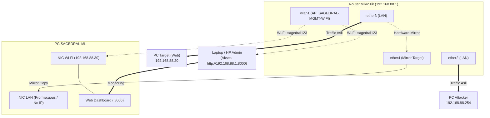

# Panduan Lengkap Uji Coba SAGEDRAL-ML (Port Mirroring + Wi-Fi Management MikroTik)

Dokumen ini merupakan panduan teknis langkah-demi-langkah (*end-to-end*) untuk melakukan pengujian sistem **SAGEDRAL-ML** menggunakan topologi **Port Mirroring** pada **Router MikroTik**, di mana antarmuka **Wi-Fi MikroTik (`wlan1`)** difungsikan secara khusus sebagai **Jalur Manajemen & Monitoring Web Dashboard**.

---

## Daftar Isi
1. [Arsitektur & Diagram Topologi Wi-Fi Management](#1-arsitektur--diagram-topologi-wi-fi-management)
2. [Tabel Alokasi Port, Wi-Fi & Rencana IP](#2-tabel-alokasi-port-wi-fi--rencana-ip)
3. [Fase 1: Konfigurasi Router MikroTik (Switch Mirror, Wi-Fi AP & Port Forwarding)](#3-fase-1-konfigurasi-router-mikrotik-switch-mirror-wi-fi-ap--port-forwarding)
4. [Fase 2: Konfigurasi PC Target (Web Server di `ether3`)](#4-fase-2-konfigurasi-pc-target-web-server-di-ether3)
5. [Fase 3: Konfigurasi PC SAGEDRAL-ML (Dual-Interface: Capture LAN + Wi-Fi Dashboard)](#5-fase-3-konfigurasi-pc-sagedral-ml-dual-interface-capture-lan--wi-fi-dashboard)
6. [Fase 4: Konfigurasi PC Attacker (`ether2`)](#6-fase-4-konfigurasi-pc-attacker-ether2)
7. [Fase 5: Verifikasi Jalur Mirror & Jalur Wi-Fi Dashboard](#7-fase-5-verifikasi-jalur-mirror--jalur-wi-fi-dashboard)
8. [Fase 6: Eksekusi Skenario Pengujian Serangan](#8-fase-6-eksekusi-skenario-pengujian-serangan)
9. [Fase 7: Analisis & Monitoring di Dashboard Web via Wi-Fi](#9-fase-7-analisis--monitoring-di-dashboard-web-via-wi-fi)
10. [Troubleshooting & Solusi Masalah Umum](#10-troubleshooting--solusi-masalah-umum)

---

## 1. Arsitektur & Diagram Topologi Wi-Fi Management

Topologi ini memisahkan secara total antara **Jalur Lalu Lintas Data Serangan (*Data Plane*)** pada kabel Ethernet dan **Jalur Manajemen & Dashboard (*Management Plane*)** pada jaringan Wi-Fi MikroTik.



#### Diagram Ringkas (Teks / ASCII):
```text
+---------------------------------------------------------+
|              Router MikroTik (192.168.88.1)             |
|  ether2 (LAN)       ether3 (LAN)        ether4 (Mirror) |
|  [Attacker]         [Target Web]        [SAGEDRAL-ML]   |
|         |                 |                    |        |
|         +===Traffic Asli==+                    |        |
|                  | (Mirror Copy)               |        |
|                  +.............................+        |
|                                                         |
|  wlan1 (Wi-Fi AP: SAGEDRAL-MGMT-WIFI | Pass: sagedral123) |
+----------------------------+----------------------------+
                             :
          +------------------+-------------------+
          v                                      v
 [ PC SAGEDRAL-ML ]                     [ Laptop / HP Admin ]
 IP Wi-Fi: 192.168.88.30               Buka Browser Dashboard:
 Host Web Dashboard :8000               http://192.168.88.1:8000
+---------------------------------------------------------+
```

### Mengapa Pemisahan Jalur Wi-Fi Ini Sangat Efektif?
1. **Isolasi Beban (*Traffic Isolation*):**
   Saat pengujian serangan DoS SYN Flood atau UDP Flood dilakukan dari `ether2` ke `ether3`, ribuan paket per detik membanjiri kabel Ethernet dan port mirror `ether4`. Jika dashboard diakses melalui kabel yang sama, tampilan web akan macet (*lag/freeze*). Dengan memindahkan dashboard ke antarmuka **Wi-Fi MikroTik**, web dashboard tetap responsif 100%.
2. **Kenyamanan Monitoring (*Wireless Monitoring*):**
   Peneliti/Operator dapat memantau grafik anomali dan serangan dari laptop atau smartphone tanpa perlu mencolokkan kabel tambahan ke router.
3. **Fleksibilitas Port Forwarding:**
   Router MikroTik telah dipasangi aturan *dst-nat* sehingga admin yang terhubung ke Wi-Fi cukup mengetikkan alamat gateway router `http://192.168.88.1:8000` untuk membuka dashboard.

---

## 2. Tabel Alokasi Port, Wi-Fi & Rencana IP

| Perangkat / Antarmuka | Tipe Koneksi | Alamat IP & Subnet | Gateway | Fungsi / Peran |
|---|---|---|---|---|
| **MikroTik Router** | `bridge-local` | `192.168.88.1/24` | - | Gateway router untuk LAN & Wi-Fi |
| **MikroTik `wlan1`** | **Wi-Fi AP** | `192.168.88.1/24` | - | **SSID:** `SAGEDRAL-MGMT-WIFI`<br>**Pass:** `sagedral123` |
| **PC Attacker** | Kabel (`ether2`) | `192.168.88.254/24` (DHCP) | `192.168.88.1` | Penguji/Peluncur serangan |
| **PC Target** | Kabel (`ether3`) | `192.168.88.20/24` | `192.168.88.1` | Web Server (Port 80/TCP) |
| **PC SAGEDRAL-ML (NIC 1)** | Kabel (`ether4`) | **0.0.0.0 (Tanpa IP)** | - | **Promiscuous Mode** (Menyerap Salinan Mirror) |
| **PC SAGEDRAL-ML (NIC 2)** | **Koneksi Wi-Fi** | `192.168.88.30/24` | `192.168.88.1` | **Management IP** (Web Dashboard & API) |
| **Laptop / HP Admin** | **Koneksi Wi-Fi** | `192.168.88.x/24` (DHCP) | `192.168.88.1` | Membuka Dashboard Web di browser |

---

## 3. Fase 1: Konfigurasi Router MikroTik (Switch Mirror, Wi-Fi AP & Port Forwarding)

> [!NOTE]
> **Status Konfigurasi:**
> Seluruh konfigurasi di bawah ini telah diterapkan dan diverifikasi aktif langsung pada router MikroTik Anda (`RB951Ui-2HnD`).

### Rincian Konfigurasi yang Telah Diterapkan di MikroTik:
```routeros
# 1. Identitas Router
/system identity set name="MikroTik-SAGEDRAL-Lab"

# 2. Port Mirroring Hardware (Switch Chip Atheros-8227)
#    Lalu lintas masuk & keluar dari Target (ether3) disalin ke SAGEDRAL-ML (ether4)
/interface ethernet switch set switch1 mirror-source=ether3-slave-local mirror-target=ether4-slave-local

# 3. Konfigurasi Access Point Wi-Fi untuk Jalur Management Dashboard
/interface wireless security-profiles set [find default=yes] mode=dynamic-keys authentication-types=wpa2-psk unicast-ciphers=aes-ccm group-ciphers=aes-ccm wpa2-pre-shared-key="sagedral123"
/interface wireless set wlan1 ssid="SAGEDRAL-MGMT-WIFI" mode=ap-bridge band=2ghz-b/g/n disabled=no

# 4. Gateway, DHCP Server & DNS Lokal
/ip address add address=192.168.88.1/24 interface=bridge-local
/ip pool add name=default-dhcp ranges=192.168.88.10-192.168.88.254
/ip dhcp-server add address-pool=default-dhcp interface=bridge-local name=default disabled=no
/ip dns set allow-remote-requests=yes
/ip dns static add name=dashboard.sagedral.local address=192.168.88.30

# 5. Port Forwarding & Hairpin NAT Dashboard (Akses langsung via IP Router :8000 dari Wi-Fi/LAN)
/ip firewall nat add chain=dstnat protocol=tcp dst-port=8000 action=dst-nat to-addresses=192.168.88.30 to-ports=8000 comment="Forward Dashboard SAGEDRAL-ML"
/ip firewall nat add chain=srcnat src-address=192.168.88.0/24 dst-address=192.168.88.30 protocol=tcp dst-port=8000 action=masquerade comment="Hairpin NAT for Dashboard"
```

---

## 4. Fase 2: Konfigurasi PC Target (Web Server di `ether3`)

Hubungkan kabel LAN dari **PC Target** ke port **`ether3`** di MikroTik.

### 4.1 Set IP Statis Target (Linux):
```bash
sudo ip addr add 192.168.88.20/24 dev eth0
sudo ip link set eth0 up
sudo ip route add default via 192.168.88.1
```

### 4.2 Jalankan Web Server:
Pilih salah satu web server berikut di PC Target:
```bash
# Opsi A: Web server bawaan Python 3
python3 -m http.server 80

# Opsi B: Nginx Web Server
sudo systemctl restart nginx

# Opsi C: Container DVWA
docker run -d -p 80:80 --name dvwa vulnerables/web-dvwa
```

---

## 5. Fase 3: Konfigurasi PC SAGEDRAL-ML (Dual-Interface: Capture LAN + Wi-Fi Dashboard)

PC SAGEDRAL-ML menggunakan 2 kartu jaringan:
1. **Ethernet (Kabel):** Tercolok ke `ether4` MikroTik untuk capture data.
2. **Wi-Fi:** Terhubung ke `SAGEDRAL-MGMT-WIFI` untuk hosting Web Dashboard.

---

### Langkah 5.1: Hubungkan PC SAGEDRAL-ML ke Wi-Fi MikroTik
Di terminal PC SAGEDRAL-ML (Linux):
```bash
# 1. Konek ke Wi-Fi Management MikroTik
sudo nmcli dev wifi connect "SAGEDRAL-MGMT-WIFI" password "sagedral123"

# 2. Tetapkan IP Statis 192.168.88.30 pada koneksi Wi-Fi (agar cocok dengan aturan DNS/NAT MikroTik)
sudo nmcli connection modify "SAGEDRAL-MGMT-WIFI" ipv4.addresses 192.168.88.30/24 ipv4.gateway 192.168.88.1 ipv4.dns 192.168.88.1 ipv4.method manual
sudo nmcli connection up "SAGEDRAL-MGMT-WIFI"

# 3. Verifikasi IP Wi-Fi
ip -brief addr show dev wlan0
```
*(Pastikan IP Wi-Fi adalah `192.168.88.30`)*.

---

### Langkah 5.2: Atur Interface Ethernet (`ether4`) ke Mode Promiscuous (Tanpa IP)
Antarmuka kabel LAN yang dicolok ke `ether4` adalah `enp1s0` (atau `enp2s0`/`eth0`):

```bash
# 1. Hapus semua IP di interface kabel capture agar tidak mengirim paket host dan routing default tetap lewat Wi-Fi
sudo ip addr flush dev enp1s0

# 2. Nyalakan interface dan aktifkan mode promiscuous
sudo ip link set enp1s0 up
sudo ip link set enp1s0 promisc on

# 3. Verifikasi status PROMISC
ip -details link show enp1s0 | grep -i promisc
```

---

### Langkah 5.3: Konfigurasi File `/etc/sagedral/config.toml`
Buka file konfigurasi SAGEDRAL-ML:
```bash
sudo nano /etc/sagedral/config.toml
```

Sesuaikan parameter:
```toml
[capture]
interface = "enp2s0"         # Antarmuka kabel Ethernet yang dicolok ke ether4
backend = "af_packet"        # Backend penangkap paket performa tinggi
bpf_filter = ""
promiscuous = true
queue_maxsize = 10000

[feature_extraction]
flow_timeout = 60
max_packets_per_flow = 1000
max_active_flows = 50000

[ml]
enabled = true
model_dir = "/var/lib/sagedral-ml/models"
anomaly_threshold = 0.7
classifier_threshold = 0.6

[decision]
alert_threshold = 0.5
block_threshold = 0.7
weight_signature = 0.4
weight_ml = 0.6

[ips]
enabled = false              # Nonaktifkan karena mode SPAN pasif

[api]
host = "0.0.0.0"             # Mendengarkan pada interface Wi-Fi agar dashboard bisa diakses
port = 8000
metrics_enabled = true
```

---

### Langkah 5.4: Jalankan Service SAGEDRAL-ML & Monitor
```bash
# Validasi konfigurasi
sudo -u sagedral env HOME=/var/lib/sagedral-ml SAGEDRAL_CONFIG_PATH=/etc/sagedral/config.toml sagedral-ml config validate

# Restart service
sudo systemctl restart sagedral-ml
sudo systemctl status sagedral-ml --no-pager -l

# Jalankan terminal monitor real-time visual
sudo python3 scripts/testing/vm_side_monitor.py
```

---

## 6. Fase 4: Konfigurasi PC Attacker (`ether2`)

Komputer Anda yang dicolok ke **`ether2`** bertindak sebagai penguji serangan:
* **IP Address:** `192.168.88.254` (Otomatis dari DHCP MikroTik).
* **Gateway:** `192.168.88.1`.

Pastikan Scapy terpasang di komputer penyerang:
```bash
pip install scapy
```

---

## 7. Fase 5: Verifikasi Jalur Mirror & Jalur Wi-Fi Dashboard

Sebelum melakukan pengujian serangan, lakukan verifikasi koneksi:

### 1. Uji Akses Web Dashboard via Wi-Fi:
Hubungkan laptop atau smartphone Anda ke Wi-Fi **`SAGEDRAL-MGMT-WIFI`** (Password: `sagedral123`), lalu buka salah satu tautan berikut di browser:
* **`http://192.168.88.1:8000`** *(Akses cepat lewat IP Gateway Router)*
* **`http://dashboard.sagedral.local:8000`** *(Akses via DNS Lokal)*
* **`http://192.168.88.30:8000`** *(Akses langsung ke IP Wi-Fi PC SAGEDRAL)*

Pastikan Dashboard Web SAGEDRAL-ML terbuka dengan lancar!

### 2. Uji Penerimaan Salinan Paket di `ether4`:
Di terminal PC SAGEDRAL-ML, jalankan `tcpdump` pada interface Ethernet:
```bash
sudo tcpdump -i enp2s0 -nn "host 192.168.88.20" -c 10
```
Sementara itu, dari PC Attacker kirimkan ping dan curl ke Target:
```powershell
ping 192.168.88.20
curl http://192.168.88.20
```
*Jika paket data muncul di terminal `tcpdump`, berarti Port Mirroring MikroTik berfungsi 100%!*

---

## 8. Fase 6: Eksekusi Skenario Pengujian Serangan

Jalankan skenario pengujian serangan dari **PC Attacker** secara berurutan. Perhatikan grafik yang muncul di **Web Dashboard via Wi-Fi**:

### Skenario 1: Traffic Normal (Baseline)
```bash
for i in {1..20}; do curl -s http://192.168.88.20/ > /dev/null; sleep 1; done
```
* **Hasil:** Anomaly score rendah (`< 0.25`), flow tercatat normal.

---

### Skenario 2: Port Scanning Attack
```bash
python scripts/testing/spoofed_portscan.py \
    --target 192.168.88.20 \
    --ports top100 \
    --interval 0.02
```
* **Hasil:** Anomaly score naik ke `0.6 - 0.8`, muncul alert berlabel `PortScan` di Dashboard.

---

### Skenario 3: DoS / DDoS SYN Flood Attack
```bash
python scripts/testing/spoofed_syn_flood.py \
    --target 192.168.88.20 \
    --port 80 \
    --pps 500 \
    --duration 20
```
* **Hasil:** Grafik *Packets Per Second (PPS)* pada dashboard melonjak tajam, anomaly score `> 0.85`, terdeteksi sebagai `DoS/DDoS` atau `SYN-Flood`.

---

### Skenario 4: UDP Flood Attack
```bash
python scripts/testing/spoofed_udp_flood.py \
    --target 192.168.88.20 \
    --port 80 \
    --duration 15
```
* **Hasil:** Terdeteksi lonjakan paket UDP, kategori alert: `DDoS-UDP` atau `Anomaly`.

---

### Skenario 5: Brute Force Signature Attack
```bash
python scripts/testing/spoofed_brute_force.py \
    --target 192.168.88.20 \
    --ports 80,8080 \
    --duration 15 \
    --attempts-per-port 150
```
* **Hasil:** Terdeteksi koneksi cepat berulang pada port HTTP/autentikasi, label `BruteForce` / `Web Attack`.

---

## 9. Fase 7: Analisis & Monitoring di Dashboard Web via Wi-Fi

Buka browser dari laptop atau smartphone yang terhubung ke Wi-Fi **`SAGEDRAL-MGMT-WIFI`**:
Arahkan ke: **`http://192.168.88.1:8000`**

### Poin Analisis Penting:
1. **Tab Overview (Real-Time Metrics):**
   * Amati bahwa meskipun kabel LAN sedang dibanjiri 500 paket SYN/detik, grafik dashboard tetap ter-update secara *smooth* tanpa *freeze* karena dashboard berjalan lewat antarmuka Wi-Fi.
2. **Tab Alerts:**
   * Verifikasi rincian setiap ancaman: `Attack Class`, `Anomaly Score`, `Severity`, `Source IP`, dan `Timestamp`.
3. **Tab Flow & Features:**
   * Amati bagaimana 28 fitur flow (seperti `flow_duration`, `total_fwd_packets`, `syn_flag_count`) terbentuk dari mirrored traffic di `ether4`.
4. **Pemeriksaan via CLI:**
   ```bash
   sagedral-ml alert list --limit 10
   sagedral-ml status
   ```

---

## 10. Troubleshooting & Solusi Masalah Umum

### 1. Dashboard Tidak Bisa Dibuka via Wi-Fi
* **Penyebab:** Konfigurasi `api.host` di `config.toml` masih `127.0.0.1` atau firewall Linux memblokir port 8000.
* **Solusi:**
  1. Pastikan `host = "0.0.0.0"` di `/etc/sagedral/config.toml`.
  2. Buka port 8000 di PC SAGEDRAL-ML: `sudo ufw allow 8000/tcp`.
  3. Pastikan PC SAGEDRAL-ML sudah konek ke Wi-Fi dan mendapat IP `192.168.88.30`.

### 2. Sinyal Wi-Fi `SAGEDRAL-MGMT-WIFI` Tidak Terlihat
* **Penyebab:** Radio nirkabel di MikroTik mati atau frekuensi bentrok.
* **Solusi:** Cek di terminal MikroTik:
  `/interface wireless print` (pastikan statusnya `running` dan tidak `disabled`).

### 3. Port Mirroring Tidak Mengirimkan Salinan Paket
* **Solusi:**
  1. Pastikan kabel dari Target terhubung di `ether3` dan kabel ke PC SAGEDRAL terhubung di `ether4`.
  2. Verifikasi aturan switch di MikroTik:
     `/interface ethernet switch print`
     Pastikan: `mirror-source=ether3-slave-local` dan `mirror-target=ether4-slave-local`.
