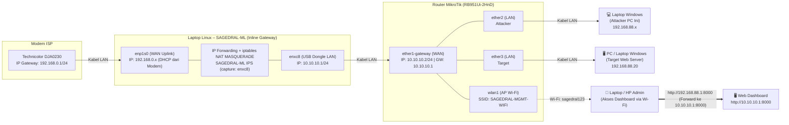

# Panduan Lengkap Uji Coba SAGEDRAL-ML (Inline / Gateway Mode + Wi-Fi Management MikroTik)

Dokumen ini merupakan panduan teknis langkah-demi-langkah (*end-to-end*) untuk pengujian sistem **SAGEDRAL-ML** dengan topologi **Inline Gateway (In-Path)** pada jaringan nyata. 

> [!IMPORTANT]
> **Prinsip Utama Alur Kerja (Workflow):**
> 1. **Prioritas #1: Pipa Saluran Internet Harus Mengalir Dulu ke Semua Perangkat.**
>    Sebelum mengkonfigurasi target serangan atau menjalankan skrip exploit, seluruh rantai internet dari modem ISP melalui laptop SAGEDRAL-ML (`enp1s0` & `enxc8`) menuju router MikroTik dan diteruskan ke laptop Attacker (`ether2`) serta Target (`ether3`) **wajib menyala dan terverifikasi lancar**. Hal ini krusial agar laptop Attacker tetap memiliki koneksi internet stabil untuk komunikasi/chat dan monitoring.
> 2. **Prioritas #2: Konfigurasi Web Server Target.**
> 3. **Prioritas #3: Aktivasi IPS SAGEDRAL-ML & Peluncuran Skenario Serangan.**

---

## Daftar Isi
1. [Perangkat Keras & Kabel Topologi](#1-perangkat-keras--kabel-topologi)
2. [Diagram Topologi & Rencana IP (enp1s0 & enxc8)](#2-diagram-topologi--rencana-ip-enp1s0--enxc8)
3. [Tabel Alokasi Interface, IP & Peran Perangkat](#3-tabel-alokasi-interface-ip--peran-perangkat)
4. [FASE 1: Membangun Jalur Internet Gateway di Laptop Linux (enp1s0 & enxc8)](#4-fase-1-membangun-jalur-internet-gateway-di-laptop-linux-enp1s0--enxc8)
5. [FASE 2: Konfigurasi Router MikroTik (Menerima WAN & Membagikan Internet)](#5-fase-2-konfigurasi-router-mikrotik-menerima-wan--membagikan-internet)
6. [FASE 3: Verifikasi Aliran Internet Lengkap ke Attacker & Target](#6-fase-3-verifikasi-aliran-internet-lengkap-ke-attacker--target)
7. [FASE 4: Konfigurasi PC / Laptop Windows Target (Web Server di ether3)](#7-fase-4-konfigurasi-pc--laptop-windows-target-web-server-di-ether3)
8. [FASE 5: Aktivasi & Konfigurasi Sistem SAGEDRAL-ML (Mode Inline IPS)](#8-fase-5-aktivasi--konfigurasi-sistem-sagedral-ml-mode-inline-ips)
9. [FASE 6: Eksekusi Skenario Pengujian Serangan (Dari Laptop Attacker Windows)](#9-fase-6-eksekusi-skenario-pengujian-serangan-dari-laptop-attacker-windows)
10. [FASE 7: Analisis & Monitoring Dashboard Web via Wi-Fi](#10-fase-7-analisis--monitoring-dashboard-web-via-wi-fi)
11. [Troubleshooting & Solusi Masalah Jaringan](#11-troubleshooting--solusi-masalah-jaringan)

---

## 1. Perangkat Keras & Kabel Topologi

| # | Perangkat | Antarmuka / Port | Peran |
|---|---|---|---|
| 1 | **Modem ISP** | Technicolor DJA0230 Telstra Smart Modem Gen2 (Port LAN: `192.168.0.1/24`) | Sumber koneksi internet utama |
| 2 | **Laptop Linux (SAGEDRAL-ML)** | - Port bawaan: **`enp1s0`** (Uplink WAN ke Modem)<br>- USB Dongle ETH: **`enxc8`** (Downlink LAN ke MikroTik) | Router Gateway Inline & Mesin Deteksi/Pencegahan Intrusi (IPS) |
| 3 | **Router MikroTik** | `RB951Ui-2HnD`<br>- `ether1`: Uplink WAN ke Dongle `enxc8`<br>- `ether2`: LAN ke Attacker<br>- `ether3`: LAN ke Target<br>- `wlan1`: AP Wi-Fi Management | Switch/Router distribusi LAN & Access Point untuk pemantauan dashboard |
| 4 | **Laptop Windows (Attacker)** | Port LAN Ethernet terhubung ke port **`ether2`** MikroTik | Meluncurkan traffic uji dan serangan (Scapy/Python) |
| 5 | **PC / Laptop Windows (Target)** | Port LAN Ethernet terhubung ke port **`ether3`** MikroTik | Menjalankan Web Server (Port 80/TCP) |
| 6 | **HP / Laptop Admin (Dashboard)** | Terkoneksi secara nirkabel via **Wi-Fi AP** MikroTik | Monitoring Web Dashboard secara terisolasi |

**Koneksi Fisik Kabel:**
```text
[Modem Port LAN] ===(Kabel 1)===> [Laptop Linux enp1s0]
[Laptop Linux Dongle enxc8] ======(Kabel 2)===> [MikroTik ether1]
[MikroTik ether2] ===============(Kabel 3)===> [Laptop Windows Attacker]
[MikroTik ether3] ===============(Kabel 4)===> [PC Windows Target]
```

---

## 2. Diagram Topologi & Rencana IP (enp1s0 & enxc8)

### Diagram Mermaid



### Diagram ASCII:

```text
+-------------------------+
| Modem Technicolor       |  IP: 192.168.0.1/24
| DJA0230 Telstra (ISP)   |  (Internet Aktif)
+------------+------------+
             |
             | Kabel LAN 1
             v
+------------+----------------------------------------------------+
| Laptop Linux – SAGEDRAL-ML (Inline Gateway)                    |
|                                                                 |
|   Interface WAN: enp1s0  ---> IP: 192.168.0.x (DHCP dari modem) |
|   Interface LAN: enxc8   ---> IP: 10.10.10.1/24 (USB Dongle)    |
|                                                                 |
|   - IP Forwarding Kernel : net.ipv4.ip_forward = 1              |
|   - NAT Masquerade       : iptables -t nat -A POSTROUTING       |
|                            -o enp1s0 -j MASQUERADE              |
|   - SAGEDRAL-ML IPS      : In-path inspection di enxc8          |
+------------+----------------------------------------------------+
             |
             | Kabel LAN 2 (dari USB Dongle enxc8)
             v
+------------+----------------------------------------------------+
| Router MikroTik (RB951Ui-2HnD)                                 |
|                                                                 |
|   ether1-gateway : IP 10.10.10.2/24 (Gateway: 10.10.10.1)       |
|   bridge-local   : IP 192.168.88.1/24 (DHCP Server: .10-.254)   |
|   wlan1          : AP "SAGEDRAL-MGMT-WIFI" (Pass: sagedral123)  |
|   Port Forward   : TCP 8000 -> 10.10.10.1:8000                  |
+----+---------------+-------------------------------+------------+
     |               |                               |
     | ether2        | ether3                        | wlan1 (Wi-Fi)
     v               v                               v
[Laptop Windows] [PC Windows Target]           [Admin HP / Laptop]
Attacker (PC Ini) Web Server (Port 80)          Buka Dashboard:
IP: 192.168.88.x  IP: 192.168.88.20             http://192.168.88.1:8000
```

---

## 3. Tabel Alokasi Interface, IP & Peran Perangkat

| Perangkat | Interface | Segmen Jaringan | Alamat IP | Default Gateway | Fungsi / Peran |
|---|---|---|---|---|---|
| **Modem DJA0230** | Port LAN | `192.168.0.0/24` | `192.168.0.1` | - | Sumber internet ISP |
| **Laptop SAGEDRAL** | **`enp1s0`** (NIC bawaan) | `192.168.0.0/24` | `192.168.0.x` (DHCP) | `192.168.0.1` | WAN uplink ke modem |
| **Laptop SAGEDRAL** | **`enxc8`** (USB Dongle) | `10.10.10.0/24` | `10.10.10.1/24` | - | Gateway LAN bagi MikroTik & Jalur IPS |
| **MikroTik Router** | `ether1-gateway` | `10.10.10.0/24` | `10.10.10.2/24` | `10.10.10.1` | WAN uplink ke laptop SAGEDRAL |
| **MikroTik Router** | `bridge-local` | `192.168.88.0/24` | `192.168.88.1/24` | - | Gateway lokal Attacker, Target, dan Wi-Fi |
| **Laptop Attacker** | Ethernet (Kabel) | `192.168.88.0/24` | `192.168.88.x` (DHCP) | `192.168.88.1` | Penguji/peluncur serangan (Laptop ini) |
| **PC Target** | Ethernet (Kabel) | `192.168.88.0/24` | `192.168.88.20/24` | `192.168.88.1` | Web Server korban serangan (Port 80) |
| **Wi-Fi MikroTik** | `wlan1` | `192.168.88.0/24` | `192.168.88.1/24` | - | **SSID:** `SAGEDRAL-MGMT-WIFI` (Pass: `sagedral123`) |
| **Admin Device** | Wi-Fi | `192.168.88.0/24` | `192.168.88.x` (DHCP) | `192.168.88.1` | Membuka Web Dashboard SAGEDRAL-ML |

---

## 4. FASE 1: Membangun Jalur Internet Gateway di Laptop Linux (`enp1s0` & `enxc8`)

Tujuan fase ini adalah **mengalirkan internet dari modem ISP (`enp1s0`) tembus ke USB Dongle (`enxc8`)**.

> [!CAUTION]
> **JANGAN aktifkan aturan NFQUEUE atau modul blocking IPS pada fase ini!** 
> Kita ingin memastikan jalur routing dasar (*IP Forwarding & NAT*) stabil 100% terlebih dahulu agar internet tidak terblokir.

---

### Langkah 1.1: Pastikan Nama Interface di Linux

Buka terminal di **Laptop Linux SAGEDRAL-ML**:
```bash
# Tampilkan seluruh interface jaringan
ip -brief link show
```
Pastikan terlihat:
- **`enp1s0`**: Port ethernet bawaan yang tercolok ke Modem Technicolor.
- **`enxc8`** (atau nama lengkapnya misal `enxc879544...`): Dongle USB Ethernet yang tercolok ke `ether1` MikroTik.

*(Jika nama dongle memiliki karakter panjang setelah `enxc8`, sesuaikan variabel nama antarmuka di bawah).*

---

### Langkah 1.2: Pastikan `enp1s0` Mendapat IP & Internet dari Modem

```bash
# Ambil IP otomatis dari DHCP Modem Technicolor
sudo dhclient enp1s0

# Periksa IP dan Default Gateway
ip -brief addr show dev enp1s0
ip route show default

# Uji internet langsung dari laptop Linux:
ping -c 3 192.168.0.1
ping -c 3 1.1.1.1
```
*Pastikan ping ke `1.1.1.1` mendapat respon sukses!*

---

### Langkah 1.3: Konfigurasi IP Statis pada Dongle USB (`enxc8`)

Dongle USB `enxc8` bertindak sebagai gateway bagi MikroTik:
```bash
# 1. Bersihkan IP lama jika ada
sudo ip addr flush dev enxc8

# 2. Pasang IP Statis 10.10.10.1/24
sudo ip addr add 10.10.10.1/24 dev enxc8

# 3. Aktifkan interface dongle
sudo ip link set enxc8 up

# 4. Verifikasi
ip -brief addr show dev enxc8
```

---

### Langkah 1.4: Aktifkan IP Forwarding Kernel Linux

Agar kernel Linux mengizinkan paket dari `enxc8` menyeberang ke `enp1s0`:
```bash
# Aktifkan sementara (langsung aktif detik ini juga)
sudo sysctl -w net.ipv4.ip_forward=1

# Buat permanen agar tetap aktif saat laptop reboot
if ! grep -q "net.ipv4.ip_forward = 1" /etc/sysctl.conf; then
  echo "net.ipv4.ip_forward = 1" | sudo tee -a /etc/sysctl.conf
fi
sudo sysctl -p
```

---

### Langkah 1.5: Konfigurasi iptables NAT Masquerade (Routing Internet)

```bash
# 1. Kosongkan aturan firewall lama yang mungkin menghambat
sudo iptables -F FORWARD

# 2. Masquerade traffic dari Lab (enxc8) yang keluar via Modem (enp1s0)
sudo iptables -t nat -A POSTROUTING -o enp1s0 -j MASQUERADE

# 3. Izinkan aliran paket dua arah antara enxc8 dan enp1s0
sudo iptables -A FORWARD -i enxc8 -o enp1s0 -j ACCEPT
sudo iptables -A FORWARD -i enp1s0 -o enxc8 -m state --state RELATED,ESTABLISHED -j ACCEPT

# 4. Verifikasi aturan yang aktif
sudo iptables -t nat -L -n -v
sudo iptables -L FORWARD -n -v
```

> [!TIP]
> Simpan konfigurasi iptables agar permanen:
> ```bash
> sudo apt install iptables-persistent -y
> sudo netfilter-persistent save
> ```

---

## 5. FASE 2: Konfigurasi Router MikroTik (Menerima WAN & Membagikan Internet)

> [!NOTE]
> Konfigurasi MikroTik ini telah diverifikasi dan dapat dieksekusi langsung dari terminal router MikroTik.

```routeros
# 1. Pastikan Port Mirroring lama dinonaktifkan
/interface ethernet switch set switch1 mirror-source=none mirror-target=none

# 2. Konfigurasi IP Statis WAN pada ether1-gateway (menghubung ke enxc8)
/ip address add address=10.10.10.2/24 interface=ether1-gateway comment="WAN ke SAGEDRAL-ML enxc8"

# 3. Konfigurasi Default Route mengarah ke IP Laptop Linux enxc8 (10.10.10.1)
/ip route add dst-address=0.0.0.0/0 gateway=10.10.10.1 distance=1 comment="Default Gateway via SAGEDRAL-ML"

# 4. Pastikan bridge-local menyatukan ether2, ether3, dan wlan1
/interface bridge port add bridge=bridge-local interface=ether2-master-local
/interface bridge port add bridge=bridge-local interface=wlan1

# 5. IP Gateway Lokal & DHCP Server untuk LAN
/ip address add address=192.168.88.1/24 interface=bridge-local comment="LAN Gateway"
/ip pool add name=default-dhcp ranges=192.168.88.10-192.168.88.254
/ip dhcp-server add address-pool=default-dhcp interface=bridge-local name=default disabled=no
/ip dhcp-server network add address=192.168.88.0/24 gateway=192.168.88.1 dns-server=8.8.8.8,1.1.1.1

# 6. NAT Masquerade agar paket dari LAN keluar via ether1-gateway
/ip firewall nat add chain=srcnat out-interface=ether1-gateway action=masquerade comment="NAT WAN ke SAGEDRAL"

# 7. Aktifkan Wi-Fi AP Management Dashboard
/interface wireless security-profiles set [find default=yes] mode=dynamic-keys authentication-types=wpa2-psk unicast-ciphers=aes-ccm group-ciphers=aes-ccm wpa2-pre-shared-key="sagedral123"
/interface wireless set wlan1 ssid="SAGEDRAL-MGMT-WIFI" mode=ap-bridge band=2ghz-b/g/n disabled=no

# 8. DNS Lokal & Port Forwarding Dashboard Web (:8000 -> 10.10.10.1:8000)
/ip dns set allow-remote-requests=yes
/ip dns static add name=dashboard.sagedral.local address=10.10.10.1
/ip firewall nat add chain=dstnat protocol=tcp dst-port=8000 action=dst-nat to-addresses=10.10.10.1 to-ports=8000 comment="Forward Dashboard"
/ip firewall nat add chain=srcnat src-address=192.168.88.0/24 dst-address=10.10.10.1 protocol=tcp dst-port=8000 action=masquerade comment="Hairpin NAT Dashboard"
```

---

## 6. FASE 3: Verifikasi Aliran Internet Lengkap ke Attacker & Target

> [!IMPORTANT]
> **Tahap Kunci:** Jangan berpindah ke Fase 4 sebelum pengujian pada fase ini lulus 100%!

### Langkah 3.1: Hubungkan Laptop Attacker Windows ke `ether2` MikroTik
1. Tancapkan kabel LAN dari laptop ini ke port **`ether2`** MikroTik.
2. Pastikan lampu indikator port `ether2` menyala hijau.

### Langkah 3.2: Prioritaskan Interface Ethernet di Windows
Di PowerShell (Administrator) pada Laptop Attacker ini, jalankan:
```powershell
# Berikan prioritas metrik tertinggi (metric 5) pada kabel Ethernet LAN
Set-NetIPInterface -InterfaceAlias "Ethernet" -InterfaceMetric 5

# Perbarui IP dari DHCP MikroTik
ipconfig /renew
ipconfig
```
*(Pastikan adapter Ethernet mendapatkan IP seperti `192.168.88.x` dengan Default Gateway `192.168.88.1`)*.

### Langkah 3.3: Uji Rantai Koneksi dari Laptop Attacker (Kabel Ethernet)
Jalankan pengujian bertingkat di PowerShell:
```powershell
# Level 1: Ping Router MikroTik
ping 192.168.88.1

# Level 2: Ping Dongle USB Linux SAGEDRAL-ML
ping 10.10.10.1

# Level 3: Ping Modem ISP Technicolor
ping 192.168.0.1

# Level 4: Ping Internet Publik
ping 1.1.1.1

# Level 5: Uji Resolusi Domain Internet
Resolve-DnsName google.com
```

*Jika Level 1 sampai Level 5 semuanya sukses reply, maka **internet telah mengalir sempurna melalui Laptop SAGEDRAL-ML ke Laptop Attacker ini!** Sesi chat dengan AI aman berjalan lancar lewat kabel LAN.*

### Langkah 3.4: Hubungkan PC / Laptop Target ke `ether3` MikroTik
1. Tancapkan kabel LAN PC Target ke port **`ether3`** MikroTik.
2. Dari PC Target, buka terminal/PowerShell dan uji internet:
   ```powershell
   ping 192.168.88.1
   ping 1.1.1.1
   ```
*Kedua PC (Attacker & Target) kini telah terhubung ke jaringan internet yang sama melalui gateway SAGEDRAL-ML.*

---

## 7. FASE 4: Konfigurasi PC / Laptop Windows Target (Web Server di `ether3`)

Setelah internet terbukti mengalir, siapkan PC Target sebagai server korban serangan:

### Langkah 4.1: Tetapkan IP Statis di Windows Target (Rekomendasi)
Di PowerShell **Administrator** PC Target:
```powershell
# Tetapkan IP Statis 192.168.88.20/24 dengan Gateway 192.168.88.1
New-NetIPAddress -InterfaceAlias "Ethernet" -IPAddress 192.168.88.20 -PrefixLength 24 -DefaultGateway 192.168.88.1
Set-DnsClientServerAddress -InterfaceAlias "Ethernet" -ServerAddresses ("8.8.8.8","1.1.1.1")
```

### Langkah 4.2: Buka Port 80 & Ping di Windows Defender Firewall Target
> [!WARNING]
> Windows Firewall memblokir ping dan port HTTP baru secara default. Aturan ini wajib diaktifkan:
```powershell
# 1. Izinkan Ping (ICMPv4) masuk
netsh advfirewall firewall add rule name="SAGEDRAL Lab - Allow ICMPv4" protocol=icmpv4:8,any dir=in action=allow

# 2. Izinkan Port 80 HTTP masuk
New-NetFirewallRule -DisplayName "SAGEDRAL Lab - Allow Port 80 HTTP" -Direction Inbound -LocalPort 80 -Protocol TCP -Action Allow
```

### Langkah 4.3: Jalankan Web Server di Windows Target
Pilih salah satu metode berikut di PC Target:
```powershell
# Opsi Praktis: Web Server Python 3
python -m http.server 80

# Opsi Alternatif: Node.js http-server
npx http-server -p 80
```

### Langkah 4.4: Uji Akses Web dari Laptop Attacker
Dari Laptop Attacker (laptop ini):
```powershell
# Uji ping ke target
ping 192.168.88.20

# Uji request HTTP ke web server target
Invoke-WebRequest -Uri http://192.168.88.20 -UseBasicParsing
```
*Jika respon HTTP 200 OK muncul, target siap diuji!*

---

## 8. FASE 5: Aktivasi & Konfigurasi Sistem SAGEDRAL-ML (Mode Inline IPS)

Sekarang kita mengaktifkan mesin machine learning & IPS pada laptop Linux.

### Langkah 5.1: Konfigurasi File `/etc/sagedral/config.toml`
Di **Laptop Linux**:
```bash
sudo nano /etc/sagedral/config.toml
```

Pastikan parameternya sesuai interface `enxc8`:
```toml
[capture]
interface = "enxc8"           # Antarmuka USB Dongle LAN yang mengarah ke MikroTik
backend = "af_packet"
bpf_filter = ""
promiscuous = true
queue_maxsize = 10000

[feature_extraction]
flow_timeout = 60
max_packets_per_flow = 1000
max_active_flows = 50000

[ml]
enabled = true
model_dir = "/var/lib/sagedral-ml/models"
anomaly_threshold = 0.7
classifier_threshold = 0.6

[decision]
alert_threshold = 0.5
block_threshold = 0.7
weight_signature = 0.4
weight_ml = 0.6

[ips]
enabled = true                # Mode IPS aktif (Inline)
mode = "nfqueue"              # Menggunakan NFQUEUE untuk pemblokiran
queue_num = 0
block_action = "drop"

[api]
host = "0.0.0.0"              # Mendengarkan di semua antarmuka agar dashboard bisa diakses
port = 8000
metrics_enabled = true
```

### Langkah 5.2: Jalankan Service SAGEDRAL-ML
```bash
# Validasi file konfigurasi
sudo -u sagedral env HOME=/var/lib/sagedral-ml SAGEDRAL_CONFIG_PATH=/etc/sagedral/config.toml sagedral-ml config validate

# Restart service
sudo systemctl restart sagedral-ml
sudo systemctl status sagedral-ml --no-pager -l
```

### Langkah 5.3: Pasang Aturan NFQUEUE untuk Intervensi Paket (Blocking Aktif)
> [!IMPORTANT]
> Jalankan perintah ini **hanya setelah** service `sagedral-ml` berjalan aktif.
```bash
sudo iptables -I FORWARD 1 -j NFQUEUE --queue-num 0
```
*(Jika ingin menonaktifkan pemblokiran sementara, cukup hapus: `sudo iptables -D FORWARD 1`).*

---

## 9. FASE 6: Eksekusi Skenario Pengujian Serangan (Dari Laptop Attacker Windows)

Jalankan skenario pengujian dari **Laptop Windows Attacker** secara berurutan:

### Skenario 1: Traffic Normal (Baseline)
```powershell
for ($i=1; $i -le 20; $i++) { Invoke-WebRequest -Uri http://192.168.88.20/ -UseBasicParsing | Out-Null; Start-Sleep 1 }
```
- **Hasil:** Anomaly score rendah (`< 0.25`), koneksi normal lancar.

---

### Skenario 2: Port Scanning Attack
```powershell
python scripts\testing\spoofed_portscan.py `
    --target 192.168.88.20 `
    --ports top100 `
    --interval 0.02
```
- **Hasil:** Anomaly score naik ke `0.6 - 0.8`, alert `PortScan` tercatat di dashboard.

---

### Skenario 3: DoS / DDoS SYN Flood Attack
```powershell
python scripts\testing\spoofed_syn_flood.py `
    --target 192.168.88.20 `
    --port 80 `
    --pps 500 `
    --duration 20
```
- **Hasil:** PPS melonjak tajam, score `> 0.85`, modul IPS SAGEDRAL-ML **men-drop paket banjir** sebelum mencapai PC Target.

---

### Skenario 4: UDP Flood Attack
```powershell
python scripts\testing\spoofed_udp_flood.py `
    --target 192.168.88.20 `
    --port 53 `
    --duration 15
```
- **Hasil:** Terdeteksi lonjakan anomali UDP, alert `DDoS-UDP`.

---

### Skenario 5: Brute Force / Web Attack
```powershell
python scripts\testing\spoofed_brute_force.py `
    --target 192.168.88.20 `
    --ports 80,8080 `
    --duration 15 `
    --attempts-per-port 150
```
- **Hasil:** Terdeteksi koneksi berulang cepat ke port HTTP, label `BruteForce / Web Attack`.

---

## 10. FASE 7: Analisis & Monitoring Dashboard Web via Wi-Fi

Hubungkan perangkat admin (atau smartphone/laptop) ke Wi-Fi **`SAGEDRAL-MGMT-WIFI`** (Password: `sagedral123`):
Arahkan browser ke: **`http://192.168.88.1:8000`**

### Poin Evaluasi Penting:
1. **Responsivitas Dashboard:** Web dashboard tetap terbuka mulus dan tidak mengalami lagging berkat pemisahan fisik jalur manajemen di jaringan Wi-Fi.
2. **Tab Alerts:** Verifikasi kolom `Action` (apakah berstatus `ALERT` atau `BLOCK/DROP`).
3. **Tab Flow & Real-time Metrics:** Amati 28 fitur flow paket yang diinspeksi secara inline di interface `enxc8`.
4. **Verifikasi Beban di Target:**
   Di PowerShell PC Target, amati bahwa server tidak mengalami crash/down karena paket serangan telah dipotong di gateway SAGEDRAL-ML:
   ```powershell
   Get-NetTCPConnection -LocalPort 80 -State Listen, Established
   ```

---

## 11. Troubleshooting & Solusi Masalah Jaringan

### 1. Laptop Attacker / Target Tidak Mendapat Internet
- **Cek 1 (Linux Forwarding):** Pastikan di laptop SAGEDRAL-ML `sysctl net.ipv4.ip_forward` bernilai `1`.
- **Cek 2 (iptables NAT):** Pastikan ada rule MASQUERADE di `enp1s0`: `sudo iptables -t nat -L POSTROUTING -n -v`.
- **Cek 3 (MikroTik Route):** Pastikan di MikroTik default route aktif: `/ip route print` -> `0.0.0.0/0 gateway=10.10.10.1`.

### 2. Seluruh Internet Mati Saat Service SAGEDRAL-ML Dijalankan
- **Penyebab:** Aturan NFQUEUE aktif namun antrian `queue-num 0` tidak terbaca (service down atau crash).
- **Solusi Cepat:** Hapus aturan NFQUEUE sementara agar traffic bypass normal:
  ```bash
  sudo iptables -D FORWARD 1
  ```
  Perbaiki konfigurasi `config.toml`, jalankan ulang service `systemctl restart sagedral-ml`, baru pasang kembali rule NFQUEUE.

### 3. Dashboard Web Tidak Bisa Dibuka via Wi-Fi
- **Penyebab:** Port 8000 diblokir firewall lokal Linux atau `host` di `config.toml` masih `127.0.0.1`.
- **Solusi:**
  1. Pastikan `host = "0.0.0.0"` di `/etc/sagedral/config.toml`.
  2. Buka port di firewall Linux: `sudo ufw allow 8000/tcp` atau `sudo iptables -I INPUT -p tcp --dport 8000 -j ACCEPT`.
